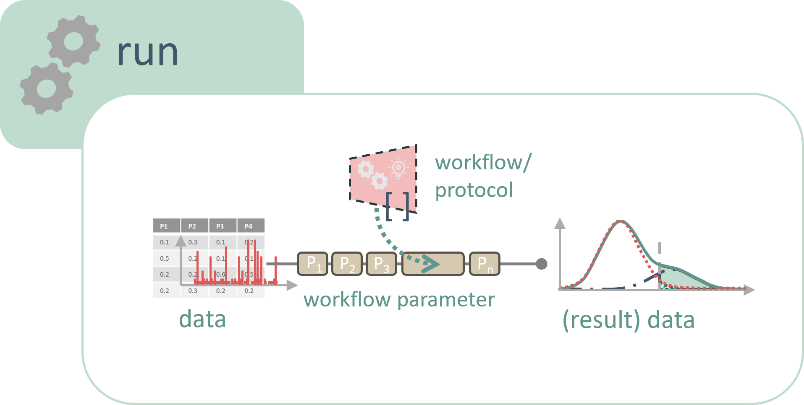
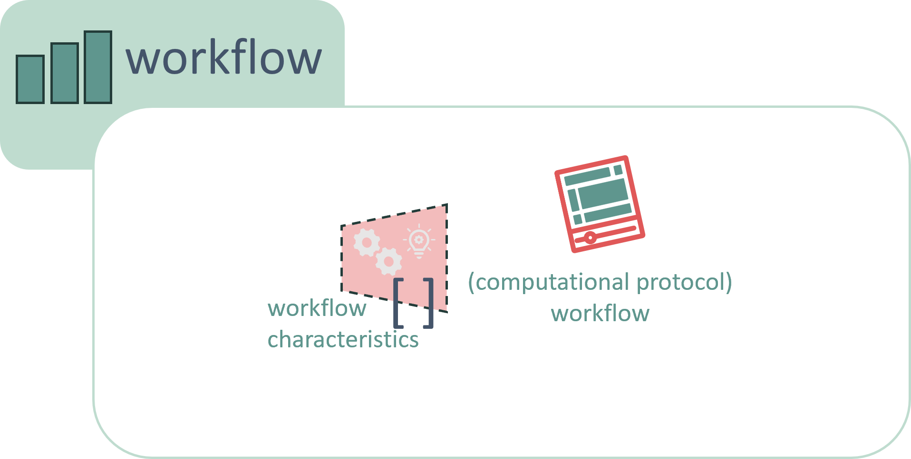

## ARC CWL RO-Crate Profile

[Latest version](profile/arc_cwl_ro_crate.md)

The ARC CWL RO-Crate profile describes how documentations of computational workflows and their invocations (runs) in Annotated Research Contexts (ARC) can be annotated in RO-Crate metadata.

When computational analysis is performed on experimental samples or on the data resulting from an assay, this process is referred to as a run.

A workflow, on the other hand, is the computational protocol detailing how the data is processed, simulated, or analyzed on a computer without actually executing the computation. Since workflows offer significant value for reuse in other datasets, they are documented separately from runs.

To annotate metadata provided in CWL in accordance with this separation, the profile uses concepts from [Workflow Run Crate](https://www.researchobject.org/workflow-run-crate/profiles/workflow_run_crate/). For seamless integration into other ARC metadata, it extends the existing profile by incorporating [ISA](https://isa-specs.readthedocs.io/en/latest/isamodel.html) terms which do the same separation into description and execution. A `LabProtocol` is used to annotate workflows, a `LabProcess` for runs.

## Contributing to this repository

The default branch `release` of this repo is kept in sync with the latest release tag and the zenodo record. 

Therefore, all contributions to this repo must target the `dev` branch, which is representing the work in progress for the next versioned release.
