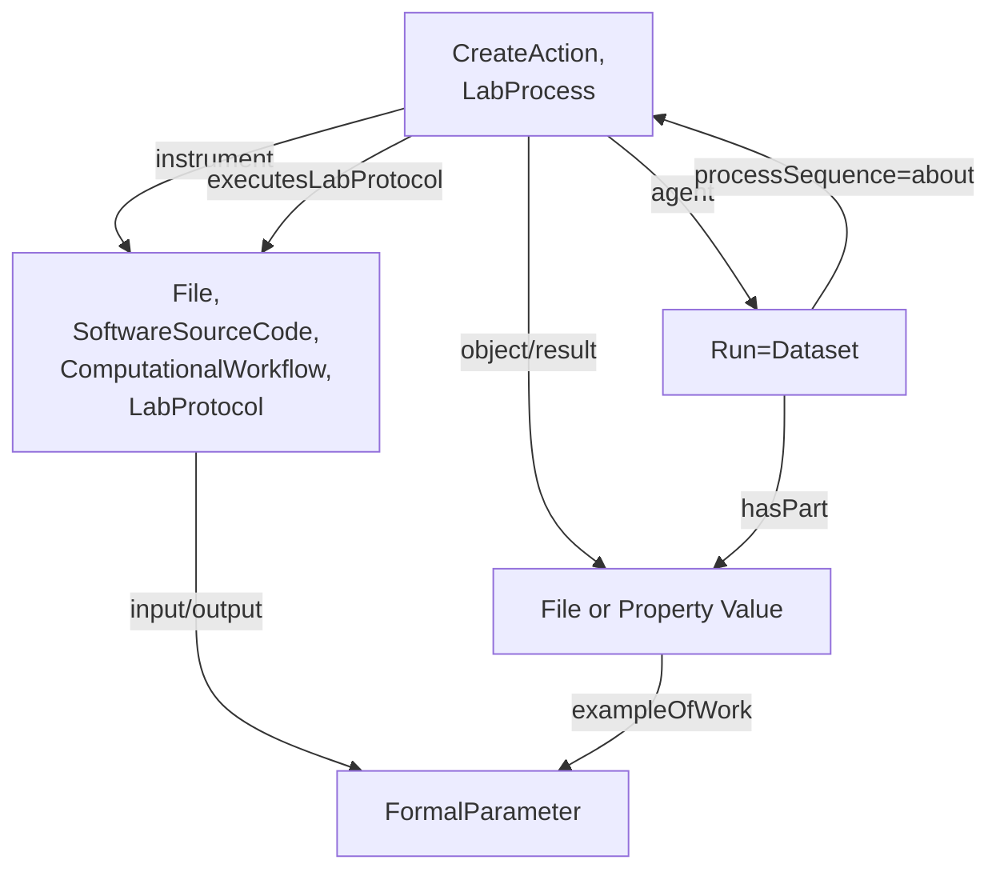
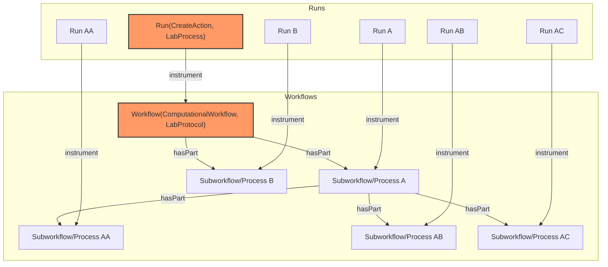

# CWL RO-Crate Profile

* Version: 0.1
* Permalink: 
* Authors
  *  - https://orcid.org/

## Overview
The ARC CWL RO-Crate profile describes computational workflows (descriptions of computational processes to transform data) and their invocations (actual executions with specific inputs, outputs and parameters) in experimental settings, specifically within the framework of Annotated Research Contexts (ARC). It therefore consists of two basic parts, called workflows and runs. The run directly references the workflow description and provides the concrete inputs, outputs and parameters for the workflow.

The Common Workflow Language (CWL) allows the use of [metadata](https://www.commonwl.org/user_guide/topics/metadata-and-authorship.html) describing the workflows. The metadata often contains general information about licensing, authorship and affiliation, but is not limited to that. It is possible to describe the steps described by a workflow, or properties describing the run execution, in more detail. This profile aims to specify where and how the metadata contained within CWL workflow and CWL job files should be stored.

The ARC CWL profile mainly follows the [Workflow Run Crate](https://www.researchobject.org/workflow-run-crate/profiles/workflow_run_crate/) profile (which itself combines [Process Run Crate](https://www.researchobject.org/workflow-run-crate/profiles/process_run_crate/)  and [Workflow RO-Crate](https://about.workflowhub.eu/Workflow-RO-Crate/)) and extends it by providing means to annotate additional metadata and align terminology with other parts of an ARC.
Computational workflows and laboratory workflows show many similarities, they typically only differ in how they are executed.
In an ARC, the latter are described using the [ISA]() model, again seperating between a workflow description ([`LabProtocol`]()) and its execution ([`LabProcess`]()).
These types provide properties to annotate parameterized metadata in the form of key-value pairs using ontology terms.
Therefore, we extend the Workflow Run Crate by integrating these types into the established model.

### The Original Data Model

The Workflow Run Crate models workflows using a combination of three types [`File`](https://schema.org/MediaObject), [`SoftwareSourceCode`](https://schema.org/SoftwareSourceCode), [`ComputationalWorkflow`](https://bioschemas.org/profiles/ComputationalWorkflow/1.0-RELEASE) following the [Bioschemas ComputationalWorkflow Profile](https://bioschemas.org/profiles/ComputationalWorkflow/1.0-RELEASE#nav-description).
Workflows can have multiple input and output parameters, defined optionally as FormalParameter entities and linked to the workflow's inputs and outputs.
An example of the original profile can be found [here](https://www.researchobject.org/ro-crate/specification/1.1/workflows.html#complete-workflow-example).
The profile requires a `ComputationalWorkflow` object to be the `mainEntity` of the `Dataset` object describing root data entity.

Runs are modeled as [CreateAction](https://schema.org/CreateAction) instances corresponding to the execution of a workflow.
They describe the execution of a computational tool that orchestrates other tools, represented as a workflow executed using a Workflow Management System (WMS).
Runs point onto the executed workflow using the `instrument` property and onto their inputs and outputs using the `object` and `result` properties.

### ARC CWL Workflow Profile

The CWL Workflow Profile extends the Workflow profile of Workflow Run Crates by incorporating how protocols are modeled in the [ISA RO-Crate Profile](https://github.com/nfdi4plants/isa-ro-crate-profile/blob/main/profile/isa_ro_crate.md#isa-ro-crate-profile). We therefore propose to use an additional multi type for the workflow profile. The type is therefore extended by [LabProtocol](https://github.com/nfdi4plants/isa-ro-crate-profile/blob/main/profile/isa_ro_crate.md#labprotocol). Parameters of protocols can be described using [`PropertyValue`](https://schema.org/PropertyValue) and [`DefinedTerm`](https://schema.org/DefinedTerm). Workflow complexity can vary. Workflows executing several tools in succession are common and require more complex annotation. We therefore use a hierarchical model: a workflow can consist of several sub-workflows pointing to them through the `hasPart` property.

### CWL Workflow Run Profile

The CWL Workflow Run Profile extends the Run profile in [Workflow Run Crate](https://www.researchobject.org/workflow-run-crate/profiles/workflow_run_crate/) by incorporating how processes are modeled in the [ISA RO-Crate Profile](https://github.com/nfdi4plants/isa-ro-crate-profile/blob/main/profile/isa_ro_crate.md#isa-ro-crate-profile). We propose to use multitype for our profile consisting of [LabProcess](https://github.com/nfdi4plants/isa-ro-crate-profile/blob/main/profile/isa_ro_crate.md#labprocess) and CreateAction of the Process Run Crate within the Workflow Run Crate. This allows the annotation of metadata describing explicit values of workflow parameters within a specific invocation. Here, we use the property `parameterValues` with objects of type `PropertyValue`.

Furthermore, each run in an ARC has its own directory, containing the CWL file as well as generated output files.
Therefore, a run is modeled in two ways: the directory as an object of type `Dataset` and the previously described `CreateAction`.
The `Dataset` objects contains the output files and the CWL file via the `hasPart` property and is the `agent` of the `CreateAction`.

As described above, workflows can be structured hierarchically, which is modeled in the RO-Crate through sub-workflows connected via `hasPart`.
In this case, runs that are invocations of sub-workflows should be modeled as the abstract run object of type `CreateAction,LabProcess`.
However, such runs do not have their own directory and therefore no corresponding Workflow Run Crate (`Dataset` object).


The `inputs` and `outputs` of the `ComputationalWorkflow` MAY point to the `objects` and `results` of `CreateAction` via `workExample`, while the latter point to the former via `exampleOfWork`.

## Requirements

### CWL Workflow Profile

The requirements of this profile are those of [Bioschemas ComputationalWorkflow Profile](https://bioschemas.org/profiles/ComputationalWorkflow/1.0-RELEASE#nav-description) 
with the modifications listed below.

#### ComputationalWorkflow
| Property | Required | Expected Type | Description |
|----------|----------|---------------|-------------|
| @type | MUST | [Text](https://schema.org/Text) | MUST be of type [File](https://schema.org/MediaObject), [SoftwareSourceCode](https://schema.org/SoftwareSourceCode), [ComputationalWorkflow](https://bioschemas.org/profiles/ComputationalWorkflow/1.0-RELEASE) and [LabProtocol](https://github.com/nfdi4plants/isa-ro-crate-profile/blob/main/profile/isa_ro_crate.md#labprotocol)|

### CWL Workflow Run Profile

The requirements of this profile are those of [Workflow Run Crate](https://www.researchobject.org/workflow-run-crate/profiles/workflow_run_crate/) 
with the modifications listed below.

#### Process Run Crate

| Property | Required | Expected Type | Description |
|----------|----------|---------------|-------------|
| @type | MUST | [Text](https://schema.org/Text) | MUST be of type [CreateAction](https://schema.org/CreateAction) and [LabProcess](https://github.com/nfdi4plants/isa-ro-crate-profile/blob/main/profile/isa_ro_crate.md#labprocess)|

## Example Workflow Run Crate configuration in ARCs



Each `run` in an ARC is described by one or more Workflow Run Crates. Theoretically, an workflow can be broken down in subworkflows and subprocesses. To reduce complexity, it is recommended to use top level description (marked red). One workflow describes the transformation of one set of input data to result data. If a second workflow is applied on the result data, it can be described in a second Workflow Run Crate. If a workflow consists of several steps, forwarding the resulting data to the next step without returning them as a final result, it is described as one Workflow Run Crate. Every ARC Run consists of one or more Workflow Runs (and is therefore comparable to an [Assay](https://github.com/nfdi4plants/isa-ro-crate-profile/blob/main/profile/isa_ro_crate.md#assay).

## Example ro-crate-metadata.json

> [!IMPORTANT]  
> Note: Examples are WIP

### CWL Workflow Profile

```json
{ "@context": "https://w3id.org/ro/crate/1.1/context",
  "@graph": [
    {
      "@type": "CreativeWork",
      "@id": "ro-crate-metadata.json",
      "conformsTo": { "@id": "https://w3id.org/ro/crate/1.1" },
      "about": { "@id": "./" }
    },
    {
      "@id": "./workflows",
      "@type": "Dataset",
      "hasPart": [
        { "@id": "workflows/workflow.cwl" }
      ]
    },
    {
      "@id": "workflows/workflow.cwl",
      "@type": [ "File", "SoftwareSourceCode", "ComputationalWorkflow" ],
      "conformsTo": { "@id": "https://bioschemas.org/profiles/ComputationalWorkflow/1.0-RELEASE" },
      "name": "Column Addition",
      "programmingLanguage": [
        { "@id": "#FSharp" },
        { "@id": "https://w3id.org/workflowhub/workflow-ro-crate#cwl" }
      ],
      "creator": { "@id": "https://orcid.org/0000-0003-3925-6778" },
      "dateCreated": "2024-02-05",
      "input": [
        { "@id": "intensity_table" },
        { "@id": "file_name" }
      ],
      "output": [
        { "@id": "summed_intensities" }
      ]
      "about": [
        # TODO add some example metadata
        # PropertyValue
      ]
    },
    {
      "@id": "intensity_table",
      "@type": "FormalParameter",
      "conformsTo": { "@id": "https://bioschemas.org/profiles/FormalParameter/0.1-DRAFT-2020_07_21/" },
      "name": "intensity_table",
      "valueRequired": true,
      "additionalType": "File",
      "format": { "@id": "http://edamontology.org/format_3752" }
    },
    {
      "@id": "file_name",
      "@type": "FormalParameter",
      "conformsTo": { "@id": "https://bioschemas.org/profiles/FormalParameter/0.1-DRAFT-2020_07_21/" },
      "name": "file_name"
    },
    {
      "@id": "summed_intensities",
      "@type": "FormalParameter",
      "conformsTo": { "@id": "https://bioschemas.org/profiles/FormalParameter/0.1-DRAFT-2020_07_21/" },
      "name": "summed_intensities",
      "additionalType": "File",
      "encodingFormat": { "@id": "http://edamontology.org/format_3475" }
    },
    {
      "@id": "https://w3id.org/workflowhub/workflow-ro-crate#cwl",
      "@type": "computerlanguage",
      "name": "common workflow language",
      "alternatename": "cwl",
      "identifier": {
        "@id": "https://w3id.org/cwl/v1.2/"
      },
      "url": {
        "@id": "https://www.commonwl.org/"
      }
    },
    {
      "@id": "#FSharp",
      "@type": "ProgrammingLanguage",
      "name": "F Sharp",
      "alternateName": "F#",
      "url": "https://dotnet.microsoft.com/en-us/languages/fsharp",
      "version": "6.0"
    },
    {
      "@id": "https://orcid.org/0000-0003-3925-6778",
      "@type": "Person",
      "name": "Timo Mühlhaus"
    },
    {
      "@id": "http://edamontology.org/format_3752",
      "@type": "Thing",
      "name": "Comma-separated values"
    },
    {
      "@id": "http://edamontology.org/format_3475",
      "@type": "Thing",
      "name": "Tab-separated values"
    }
}
```

### CWL Workflow Run Profile

```json
{ "@context": [
    "https://w3id.org/ro/terms/workflow-run/context"
  ],
  "@graph": [
    {
      "@type": "CreativeWork",
      "@id": "ro-crate-metadata.json",
      "conformsTo": { "@id": "https://w3id.org/ro/crate/1.1" },
      "about": { "@id": "./" }
    },-
    {
      "@id": "./workflows",
      "@type": "Dataset",
      "conformsTo": [
        {"@id": "https://w3id.org/ro/wfrun/process/0.1"},
        {"@id": "https://w3id.org/ro/wfrun/workflow/0.1"},
        {"@id": "https://w3id.org/workflowhub/workflow-ro-crate/1.0"}
      ],
      "hasPart": [
        { "@id": "workflows/workflow.cwl" },
        { "@id": "assays/measurement1/dataset/table.csv" }
        { "@id": "runs/fsResult1/result.csv" }
      ],
      "mainEntity": {"@id": "Galaxy-Workflow-Hello_World.ga"}
      #TODO Way to reference run instance to correctly fill "mentions" field?
    },
    {   "@id": "https://w3id.org/ro/wfrun/process/0.1",
        "@type": "CreativeWork",
        "name": "Process Run Crate",
        "version": "0.1"
    },
    {   "@id": "https://w3id.org/ro/wfrun/workflow/0.1",
        "@type": "CreativeWork",
        "name": "Workflow Run Crate",
        "version": "0.1"
    },
    {   "@id": "https://w3id.org/workflowhub/workflow-ro-crate/1.0",
        "@type": "CreativeWork",
        "name": "Workflow RO-Crate",
        "version": "1.0"
    },
    {
      "@id": "workflows/workflow.cwl",
      "@type": [ "File", "SoftwareSourceCode", "ComputationalWorkflow" ],
      "conformsTo": { "@id": "https://bioschemas.org/profiles/ComputationalWorkflow/1.0-RELEASE" },
      "name": "Column Addition",
      "programmingLanguage": [
        { "@id": "#FSharp" },
        { "@id": "https://w3id.org/workflowhub/workflow-ro-crate#cwl" }
      ],
      "creator": { "@id": "https://orcid.org/0000-0003-3925-6778" },
      "dateCreated": "2024-02-05",
      "input": [
        { "@id": "intensity_table" },
        { "@id": "file_name" }
      ],
      "output": [
        { "@id": "summed_intensities" }
      ]
      "about": [
      ]
    },
    {
      "@id": "intensity_table",
      "@type": "FormalParameter",
      "conformsTo": { "@id": "https://bioschemas.org/profiles/FormalParameter/0.1-DRAFT-2020_07_21/" },
      "name": "intensity_table",
      "valueRequired": true,
      "additionalType": "File",
      "format": { "@id": "http://edamontology.org/format_3752" },
      "workExample": {"@id": "assays/measurement1/dataset/table.csv"}
    },
    {
      "@id": "file_name",
      "@type": "FormalParameter",
      "additionalType": "Text"
      "conformsTo": { "@id": "https://bioschemas.org/profiles/FormalParameter/0.1-DRAFT-2020_07_21/" },
      "name": "file_name",
      "valueRequired": true,
      "workExample": {"@id": "file_name_filled"}
    },
    {
      "@id": "summed_intensities",
      "@type": "FormalParameter",
      "conformsTo": { "@id": "https://bioschemas.org/profiles/FormalParameter/0.1-DRAFT-2020_07_21/" },
      "name": "summed_intensities",
      "additionalType": "File",
      "encodingFormat": { "@id": "http://edamontology.org/format_3475" },
      "workExample": {"@id": "runs/fsResult1/result.csv"}
    },
    {
      "@id": "https://w3id.org/workflowhub/workflow-ro-crate#cwl",
      "@type": "computerlanguage",
      "name": "common workflow language",
      "alternatename": "cwl",
      "identifier": {
        "@id": "https://w3id.org/cwl/v1.2/"
      },
      "url": {
        "@id": "https://www.commonwl.org/"
      }
    },
    {
      "@id": "#FSharp",
      "@type": "ProgrammingLanguage",
      "name": "F Sharp",
      "alternateName": "F#",
      "url": "https://dotnet.microsoft.com/en-us/languages/fsharp",
      "version": "6.0"
    },
    {
      "@id": "https://orcid.org/0000-0003-3925-6778",
      "@type": "Person",
      "name": "Timo Mühlhaus"
    },
    {
      "@id": "http://edamontology.org/format_3752",
      "@type": "Thing",
      "name": "Comma-separated values"
    },
    {
      "@id": "http://edamontology.org/format_3475",
      "@type": "Thing",
      "name": "Tab-separated values"
    }
    {
        "@id": "#wfrun-1",
        "@type": "CreateAction",
        "name": "CWL workflow run 1",
        "endTime": "",
        "instrument": {"@id": "workflows/workflow.cwl"},
        "subjectOf": {"@id": ""},
        "object": [
            {"@id": "assays/measurement1/dataset/table.csv"},
            {"@id": "file_name_filled"}
        ],
        "result": [
            {"@id": "runs/fsResult1/result.csv"}
        ]
    },
    {
        "@id": "assays/measurement1/dataset/table.csv",
        "@type": "File",
        "description": "Number columns in csv format",
        "encodingFormat": "text/plain",
        "name": "intensity_table",
        "exampleOfWork": {"@id": "intensity_table"}
    },
    {
        "@id": "#file_name_filled",
        "@type": "PropertyValue",
        "@additionalType": "Text",
        "exampleOfWork": {"@id": "file_name"},
        "name": "file_name",
        "value": "./result.csv"
    },
    {
        "@id": "runs/fsResult1/result.csv",
        "@type": "File",
        "name": "summed_intensities",
        "description": "Summed intensity columns",
        "encodingFormat": "text/plain",
        "exampleOfWork": {"@id": "summed_intensities"}
    },
    {
        "@id": "cwltool",
        "@type": "CreativeWork",
        "encodingFormat": "text/html",
        "datePublished": "",
        "name": "Workflow Execution Example Workflow"
    }
]
}
```
