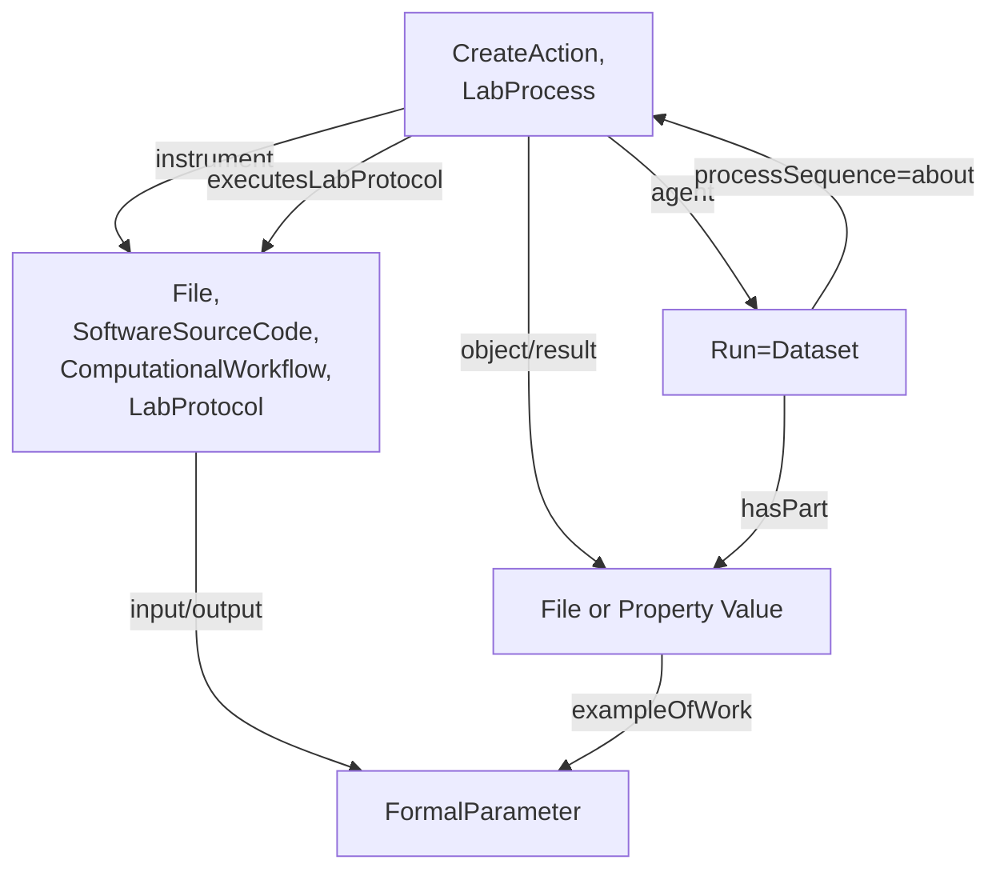
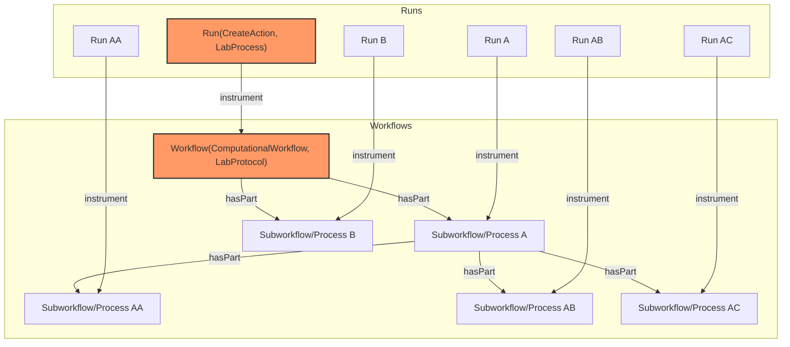

# CWL RO-Crate Profile

* Version: 0.1
* Permalink: 
* Authors
  *  - https://orcid.org/

## Overview
The ARC CWL RO-Crate profile describes computational workflows (descriptions of computational processes to transform data) and their invocations (actual executions with specific inputs, outputs and parameters) in experimental settings, specifically within the framework of Annotated Research Contexts (ARC). It therefore consists of two basic parts, called workflows and runs. The run directly references the workflow description and provides the concrete inputs, outputs and parameters for the workflow.

The Common Workflow Language (CWL) allows the use of [metadata](https://www.commonwl.org/user_guide/topics/metadata-and-authorship.html) describing the workflows. The metadata often contains general information about licensing, authorship and affiliation, but is not limited to that. It is possible to describe the steps described by a workflow, or properties describing the run execution, in more detail. This profile aims to specify where and how the metadata contained within CWL workflow and CWL job files should be stored.

The ARC CWL profile mainly follows the [Workflow Run Crate](https://www.researchobject.org/workflow-run-crate/profiles/workflow_run_crate/) profile (which itself combines [Process Run Crate](https://www.researchobject.org/workflow-run-crate/profiles/process_run_crate/)  and [Workflow RO-Crate](https://about.workflowhub.eu/Workflow-RO-Crate/)) and extends it by providing means to annotate additional metadata and align terminology with other parts of an ARC.
Computational workflows and laboratory workflows show many similarities, they typically only differ in how they are executed.
In an ARC, the latter are described using the [ISA](https://isa-specs.readthedocs.io/en/latest/isajson.html#) model, again seperating between a workflow description ([`LabProtocol`](https://bioschemas.org/types/LabProtocol/0.5-DRAFT)) and its execution ([`LabProcess`](https://bioschemas.org/types/LabProcess/0.1-DRAFT)).
These types provide properties to annotate parameterized metadata in the form of key-value pairs using ontology terms.
Therefore, we extend the Workflow Run Crate by integrating these types into the established model.

### The Original Data Model

The Workflow Run Crate models workflows using a combination of three types [`File`](https://schema.org/MediaObject), [`SoftwareSourceCode`](https://schema.org/SoftwareSourceCode), [`ComputationalWorkflow`](https://bioschemas.org/profiles/ComputationalWorkflow/1.0-RELEASE) following the [Bioschemas ComputationalWorkflow Profile](https://bioschemas.org/profiles/ComputationalWorkflow/1.0-RELEASE#nav-description).
Workflows can have multiple input and output parameters, defined optionally as FormalParameter entities and linked to the workflow's inputs and outputs.
An example of the original profile can be found [here](https://www.researchobject.org/ro-crate/specification/1.1/workflows.html#complete-workflow-example).
The profile requires a `ComputationalWorkflow` object to be the `mainEntity` of the `Dataset` object describing root data entity.

Runs are modeled as [CreateAction](https://schema.org/CreateAction) instances corresponding to the execution of a workflow.
They describe the execution of a computational tool that orchestrates other tools, represented as a workflow executed using a Workflow Management System (WMS).
Runs point onto the executed workflow using the `instrument` property and onto their inputs and outputs using the `object` and `result` properties.

### ARC CWL Workflow Profile

The CWL Workflow Profile extends the Workflow profile of Workflow Run Crates by incorporating how protocols are modeled in the [ISA RO-Crate Profile](https://github.com/nfdi4plants/isa-ro-crate-profile/blob/main/profile/isa_ro_crate.md#isa-ro-crate-profile). We therefore propose to use an additional multi type for the workflow profile. The type is therefore extended by [LabProtocol](https://github.com/nfdi4plants/isa-ro-crate-profile/blob/main/profile/isa_ro_crate.md#labprotocol). Parameters of protocols can be described using [`PropertyValue`](https://schema.org/PropertyValue) and [`DefinedTerm`](https://schema.org/DefinedTerm). Workflow complexity can vary. Workflows executing several tools in succession are common and require more complex annotation. We therefore use a hierarchical model: a workflow can consist of several sub-workflows pointing to them through the `hasPart` property.

### CWL Workflow Run Profile

The CWL Workflow Run Profile extends the Run profile in [Workflow Run Crate](https://www.researchobject.org/workflow-run-crate/profiles/workflow_run_crate/) by incorporating how processes are modeled in the [ISA RO-Crate Profile](https://github.com/nfdi4plants/isa-ro-crate-profile/blob/main/profile/isa_ro_crate.md#isa-ro-crate-profile). We propose to use multitype for our profile consisting of [LabProcess](https://github.com/nfdi4plants/isa-ro-crate-profile/blob/main/profile/isa_ro_crate.md#labprocess) and CreateAction of the Process Run Crate within the Workflow Run Crate. This allows the annotation of metadata describing explicit values of workflow parameters within a specific invocation. Here, we use the property `parameterValues` with objects of type `PropertyValue`.

Furthermore, each run in an ARC has its own directory, containing the CWL file as well as generated output files.
Therefore, a run is modeled in two ways: the directory as an object of type `Dataset` and the previously described `CreateAction`.
The `Dataset` objects contains the output files and the CWL file via the `hasPart` property and is the `agent` of the `CreateAction`.

As described above, workflows can be structured hierarchically, which is modeled in the RO-Crate through sub-workflows connected via `hasPart`.
In this case, runs that are invocations of sub-workflows should be modeled as the abstract run object of type `CreateAction,LabProcess`.
However, such runs do not have their own directory and therefore no corresponding Workflow Run Crate (`Dataset` object).


The `inputs` and `outputs` of the `ComputationalWorkflow` MAY point to the `objects` and `results` of `CreateAction` via `workExample`, while the latter point to the former via `exampleOfWork`.

## Requirements

### CWL Workflow Profile

The requirements of this profile are those of [Bioschemas ComputationalWorkflow Profile](https://bioschemas.org/profiles/ComputationalWorkflow/1.0-RELEASE#nav-description) 
with the modifications listed below.

#### ComputationalWorkflow
| Property | Required | Expected Type | Description |
|----------|----------|---------------|-------------|
| @type | MUST | [Text](https://schema.org/Text) | MUST be of type [File](https://schema.org/MediaObject), [SoftwareSourceCode](https://schema.org/SoftwareSourceCode), [ComputationalWorkflow](https://bioschemas.org/profiles/ComputationalWorkflow/1.0-RELEASE) and [LabProtocol](https://github.com/nfdi4plants/isa-ro-crate-profile/blob/main/profile/isa_ro_crate.md#labprotocol)|

### CWL Workflow Run Profile

The requirements of this profile are those of [Workflow Run Crate](https://www.researchobject.org/workflow-run-crate/profiles/workflow_run_crate/) 
with the modifications listed below.

#### Process Run Crate

| Property | Required | Expected Type | Description |
|----------|----------|---------------|-------------|
| @type | MUST | [Text](https://schema.org/Text) | MUST be of type [CreateAction](https://schema.org/CreateAction) and [LabProcess](https://github.com/nfdi4plants/isa-ro-crate-profile/blob/main/profile/isa_ro_crate.md#labprocess)|

## Example Workflow Run Crate configuration in ARCs

As described above, workflows can be structured hierarchically. Each workflow (or sub-workflow) object in the hierarchy can have an associated run object in the RO-Crate metadata. The structure of JSON objects is visualized below. Every ARC Run consists of one or more Workflow Runs (and is therefore comparable to an [Assay](https://github.com/nfdi4plants/isa-ro-crate-profile/blob/main/profile/isa_ro_crate.md#assay) in ISA). To reduce complexity, it is recommended to use top level description (marked red). One workflow describes the transformation of one set of input data to result data. If a workflow consists of several steps, forwarding the resulting data to the next step without returning them as a final result, it is described as one Workflow Run Crate. In other words, runs should only be documented for top-level workflows.



## Profile Requirements

This section describes the specifications for other Profiles that are used in the CWL RO-Crate Profile and deviate from their original 
specifications.

### ComputationalWorkflow | SoftwareSourceCode | Text | LabProtocol

| Property | Required | Cardinality | Expected Type | Description | Source Profile |
|----------|----------|-------------|---------------|-------------|----------------|
| <h4>Required Properties</h4> | | | | | |
| **`@context`** | Required | ONE | [schema.org/URL](https://schema.org/URL) | Used to provide the context (namespaces) for the JSON-LD file. Not needed in other serialisations. | https://bioschemas.org/profiles/ComputationalWorkflow |
| **`@type`** | Required | 4 | [schema.org/Text](https://schema.org/Text)<br>AND [schema.org/SoftwareSourceCode](https://schema.org/SoftwareSourceCode)<br>AND [bioschemas.org/ComputationalWorkflow](https://bioschemas.org/types/ComputationalWorkflow)<br>AND [bioschemas.org/LabProtocol](https://bioschemas.org/types/LabProtocol) | Schema.org/Bioschemas class for the resource declared using JSON-LD syntax. For other serialisations please use the appropriate mechanism. While it is permissible to provide multiple types, it is preferred to use a single type. | **THIS PROFILE** |
| **`@id`** | Required | ONE | [IRI](https://datatracker.ietf.org/doc/html/rfc3987#section-2) | Used to distinguish the resource being described in JSON-LD. For other serialisations use the appropriate approach. | https://bioschemas.org/profiles/ComputationalWorkflow |
| **`dct:conformsTo`** | Required | 2 | [IRI](https://datatracker.ietf.org/doc/html/rfc3987#section-2) | Used to state the profiles that the markup relates to. MUST be 'https://bioschemas.org/profiles/ComputationalWorkflow/1.0-RELEASE' AND `<insert our LabProtocol profile IRI here>` | https://bioschemas.org/profiles/ComputationalWorkflow |
| <h4>Recommended Properties</h4> | | | | | |
| **`input`** | Recommended | MANY | [bioschemas.org/FormalParameter](https://bioschemas.org/types/FormalParameter) | An input required to use the computational workflow (eg. Excel spreadsheet, BAM file) | https://bioschemas.org/profiles/ComputationalWorkflow |
| **`output`** | Recommended | MANY | [bioschemas.org/FormalParameter](https://bioschemas.org/types/FormalParameter) | An output produced by the workflow | https://bioschemas.org/profiles/ComputationalWorkflow |
| **`creator`** | Recommended | MANY | [schema.org/Organization](https://schema.org/Organization)<br>OR [schema.org/Person](https://schema.org/Person) | The creator/author of this CreativeWork. This is the same as the Author property for CreativeWork. | https://bioschemas.org/profiles/ComputationalWorkflow |
| **`dateCreated`** | Recommended | ONE | [schema.org/Date](https://schema.org/Date)<br>OR [schema.org/DateTime](https://schema.org/DateTime) | The date on which the CreativeWork was created or the item was added to a DataFeed. | https://bioschemas.org/profiles/ComputationalWorkflow |
| **`license`** | Recommended | MANY | [schema.org/CreativeWork](https://schema.org/CreativeWork)<br>OR [schema.org/URL](https://schema.org/URL) | A license document that applies to this content, typically indicated by URL. | https://bioschemas.org/profiles/ComputationalWorkflow |
| **`name`** | Recommended | ONE | [schema.org/Text](https://schema.org/Text) | The name of the item. | https://bioschemas.org/profiles/ComputationalWorkflow |
| **`programmingLanguage`** | Recommended | MANY | [schema.org/ComputerLanguage](https://schema.org/ComputerLanguage)<br>OR [schema.org/Text](https://schema.org/Text) | The computer programming language, Scripts written in a programming language, as well as workflows, generally need a runtime; in RO-Crate the runtime SHOULD be indicated using a liberal interpretation of programmingLanguage | https://bioschemas.org/profiles/ComputationalWorkflow |
| **`sdPublisher`** | Recommended | ONE | [schema.org/Organization](https://schema.org/Organization)<br>OR [schema.org/Person](https://schema.org/Person) | The host site for the ComputationalWorkflow | https://bioschemas.org/profiles/ComputationalWorkflow |
| **`url`** | Recommended | ONE | [schema.org/URL](https://schema.org/URL) | URL of the item. | https://bioschemas.org/profiles/ComputationalWorkflow |
| **`version`** | Recommended | ONE | [schema.org/Text](https://schema.org/Text)<br>OR [schema.org/Number](https://schema.org/Number) | Version is a release. The date modified may not warrant a release, but last date modified and access to all versions is important | https://bioschemas.org/profiles/ComputationalWorkflow |
| <h4>Optional Properties</h4> | | | | | |
| **`citation`** | Optional | MANY | [schema.org/CreativeWork](https://schema.org/CreativeWork)<br>OR [schema.org/Text](https://schema.org/Text) | A citation or reference to another creative work, such as another publication, web page, scholarly article, etc. | https://bioschemas.org/profiles/ComputationalWorkflow |
| **`contributor`** | Optional | MANY | [schema.org/Organization](https://schema.org/Organization)<br>OR [schema.org/Person](https://schema.org/Person) | A secondary contributor to the CreativeWork or Event. | https://bioschemas.org/profiles/ComputationalWorkflow |
| **`creativeWorkStatus`** | Optional | ONE | [schema.org/DefinedTerm](https://schema.org/DefinedTerm)<br>OR [schema.org/Text](https://schema.org/Text) | The status of a creative work in terms of its stage in a lifecycle. Example terms include Incomplete, Draft, Published, Obsolete. Some organizations define a set of terms for the stages of their publication lifecycle. | https://bioschemas.org/profiles/ComputationalWorkflow |
| **`description`** | Optional | ONE | [schema.org/Text](https://schema.org/Text) | A description of the item. | https://bioschemas.org/profiles/ComputationalWorkflow |
| **`documentation`** | Optional | MANY | [schema.org/CreativeWork](https://schema.org/CreativeWork)<br>OR [schema.org/URL](https://schema.org/URL) | Documentation describing the ComputationalWorkflow and its use. | https://bioschemas.org/profiles/ComputationalWorkflow |
| **`funding`** | Optional | MANY | [schema.org/Grant](https://schema.org/Grant) | The funding for the workflow | https://bioschemas.org/profiles/ComputationalWorkflow |
| **`hasPart`** | Optional | MANY | [schema.org/CreativeWork](https://schema.org/CreativeWork) | The tools/scripts that are (potentially) used by the ComputationalWorkflow when it is executed, The parts are not ordered; they normally correspond to steps in the workflow, there is no specified mapping. | https://bioschemas.org/profiles/ComputationalWorkflow |
| **`isBasedOn`** | Optional | ONE | [schema.org/CreativeWork](https://schema.org/CreativeWork)<br>OR [schema.org/Product](https://schema.org/Product)[schema.org/URL](https://schema.org/URL) | This is normally another ComputationalWorkflow, but may also be, for example, a paper or a lab protocol. | https://bioschemas.org/profiles/ComputationalWorkflow |
| **`keywords`** | Optional | ONE | [schema.org/Text](https://schema.org/Text) | Keywords or tags used to describe this content. Multiple entries in a keywords list are typically delimited by commas. | https://bioschemas.org/profiles/ComputationalWorkflow |
| **`maintainer`** | Optional | MANY | [schema.org/Organization](https://schema.org/Organization)<br>OR [schema.org/Person](https://schema.org/Person) | A maintainer of a Dataset, software package (SoftwareApplication), or other Project. A maintainer is a Person or Organization that manages contributions to, and/or publication of, some (typically complex) artifact. It is common for distributions of software and data to be based on “upstream” sources. When maintainer is applied to a specific version of something e.g. a particular version or packaging of a Dataset, it is always possible that the upstream source has a different maintainer. The isBasedOn property can be used to indicate such relationships between datasets to make the different maintenance roles clear. Similarly in the case of software, a package may have dedicated maintainers working on integration into software distributions such as Ubuntu, as well as upstream maintainers of the underlying work. | https://bioschemas.org/profiles/ComputationalWorkflow |
| **`producer`** | Optional | MANY | [schema.org/Organization](https://schema.org/Organization)<br>OR [schema.org/Person](https://schema.org/Person) | The person or organization who produced the workflow | https://bioschemas.org/profiles/ComputationalWorkflow |
| **`publisher`** | Optional | MANY | [schema.org/Organization](https://schema.org/Organization)<br>OR [schema.org/Person](https://schema.org/Person) | Where it came came from, e.g. Galaxy, github, or WF Hub if uploaded | https://bioschemas.org/profiles/ComputationalWorkflow |
| **`runtimePlatform`** | Optional | MANY | [schema.org/Text](https://schema.org/Text) | Runtime platform or script interpreter dependencies (Example - Java v1, Python2.3, .Net Framework 3.0). Supersedes runtime. | https://bioschemas.org/profiles/ComputationalWorkflow |
| **`softwareRequirements`** | Optional | MANY | [schema.org/Text](https://schema.org/Text) | Renaming schema.org/requirements as softwareRequirements | https://bioschemas.org/profiles/ComputationalWorkflow |
| **`targetProduct`** | Optional | MANY | [schema.org/SoftwareApplication](https://schema.org/SoftwareApplication) | Target Operating System / Product to which the code applies. If applies to several versions, just the product name can be used. | https://bioschemas.org/profiles/ComputationalWorkflow |
| **`intendedUse`** | Optional | ONE | [schema.org/DefinedTerm](https://schema.org/DefinedTerm)<br>OR [schema.org/Text](https://schema.org/Text)<br>OR [schema.org/URL](https://schema.org/URL) | The protocol type as an ontology term | isa-ro-crate-profile/LabProtocol |
| **`alternateName`** | Optional | MANY | [schema.org/Text](https://schema.org/Text) | An alias for the item. | https://bioschemas.org/profiles/ComputationalWorkflow |
| **`conditionsOfAccess`** | Optional | ONE | [schema.org/Text](https://schema.org/Text) | Conditions that affect the availability of, or method(s) of access to, an item. Typically used for real world items such as an ArchiveComponent held by an ArchiveOrganization. This property is not suitable for use as a general Web access control mechanism. It is expressed only in natural language. For example “Available by appointment from the Reading Room” or “Accessible only from logged-in accounts “. | https://bioschemas.org/profiles/ComputationalWorkflow |
| **`dateModified`** | Optional | ONE | [schema.org/Date](https://schema.org/Date)<br>OR [schema.org/DateTime](https://schema.org/DateTime) | The date on which the CreativeWork was most recently modified or when the item’s entry was modified within a DataFeed. | https://bioschemas.org/profiles/ComputationalWorkflow |
| **`datePublished`** | Optional | ONE | [schema.org/Date](https://schema.org/Date)<br>OR [schema.org/DateTime](https://schema.org/DateTime) | Date of first broadcast/publication. | https://bioschemas.org/profiles/ComputationalWorkflow |
| **`encodingFormat`** | Optional | MANY | [schema.org/Text](https://schema.org/Text)<br>OR [schema.org/URL](https://schema.org/URL) | Should be the type of the workflow | https://bioschemas.org/profiles/ComputationalWorkflow |
| **`identifier`** | Optional | MANY | [schema.org/Text](https://schema.org/Text)<br>OR [schema.org/PropertyValue](https://schema.org/PropertyValue)<br>OR [schema.org/URL](https://schema.org/URL) | The identifier property represents any kind of identifier for any kind of Thing, such as ISBNs, GTIN codes, UUIDs etc. Schema.org provides dedicated properties for representing many of these, either as textual strings or as URL (URI) links. See background notes for more details. | https://bioschemas.org/profiles/ComputationalWorkflow |
| **`image`** | Optional | MANY | [schema.org/ImageObject](https://schema.org/ImageObject)<br>OR [schema.org/URL](https://schema.org/URL) | An image of the item. This can be a URL or a fully described ImageObject. It can be beneficial to show a diagram or sketch to explain the script/workflow. This may have been generated from a workflow management system, or drawn manually as a diagram. | https://bioschemas.org/profiles/ComputationalWorkflow |
| **`comment`** | Optional | MANY | [schema.org/Comment](https://schema.org/Comment) |  | isa-ro-crate-profile/LabProtocol |
| **`computationalTool`** | Optional | MANY | [schema.org/SoftwareApplication](https://schema.org/SoftwareApplication)<br>OR [schema.org/DefinedTerm](https://schema.org/DefinedTerm)<br>OR [schema.org/PropertyValue](https://schema.org/PropertyValue) | Software or tool used as part of the lab protocol to complete a part of it. | isa-ro-crate-profile/LabProtocol |

### CreateAction | LabProcess

| Property | Required | Cardinality | Expected Type | Description | Source Profile |
|----------|----------|-------------|---------------|-------------|----------------|
| <h4>Required Properties</h4> | | | | | |
| **`@id`** | Required | ONE | [IRI](https://datatracker.ietf.org/doc/html/rfc3987#section-2) | A unique identifier for the execution, e.g. "urn:uuid:50ec5c76-1f7a-4130-8ef6-846756b228c1", "#f99a8e6c". MAY be an absolute URI, e.g. http://example.com/runs/846756b228c1. The use of randomly generated UUIDs (type 4) is RECOMMENDED. SHOULD be listed under mentions of the root data entity. | https://www.researchobject.org/workflow-run-crate/profiles/process_run_crate |
| **`@type`** | Required | 2 | [schema.org/CreateAction](https://schema.org/CreateAction)<br>AND [bioschemas.org/LabProcess](https://bioschemas.org/types/LabProcess/0.1-DRAFT) | MUST be LabProcess and CreateAction to indicate that this tool created the result data entities | https://github.com/nfdi4plants/arc-cwl-ro-crate-profile/blob/release/profile/arc_cwl_ro_crate.md |
| **`instrument`** | Required | MANY | [schema.org/SoftwareApplication](https://schema.org/SoftwareApplication)<br>OR [bioschemas.org/ComputationalWorkflow](https://bioschemas.org/types/ComputationalWorkflow) | Identifier of the executed tool or workflow in case of a Workflow RO-Crate. | https://www.researchobject.org/workflow-run-crate/profiles/process_run_crate; https://www.researchobject.org/workflow-run-crate/profiles/workflow_run_crate |
| **`agent`** | Required | ONE | [schema.org/Organization](https://schema.org/Organization)<br>OR [schema.org/Person](https://schema.org/Person) | Identifier of a Person or Organization contextual entity that started/executed this tool. | https://bioschemas.org/types/LabProcess/0.1-DRAFT |
| **`result`** | Required | MANY | [schema.org/MediaObject](https://schema.org/MediaObject)<br>OR [schema.org/Dataset](https://schema.org/Dataset)<br>OR [schema.org/Collection](https://schema.org/Collection)<br>OR [schema.org/CreativeWork](https://schema.org/CreativeWork)<br>OR [schema.org/PropertyValue](https://schema.org/PropertyValue) | The identifier of one or more entities that were created or modified by this action, e.g. output files. Entities referenced by an action’s object or result SHOULD be of type File (an RO-Crate alias for MediaObject) for files, Dataset for directories and Collection for multi-file datasets, but MAY be a CreativeWork for other types of data (e.g. an online database); they MAY be of type PropertyValue to capture numbers/strings that are not stored as files. | https://www.researchobject.org/workflow-run-crate/profiles/process_run_crate, https://bioschemas.org/types/LabProcess/0.1-DRAFT |
| **`object`** | Required | MANY | [schema.org/MediaObject](https://schema.org/MediaObject)<br>OR [schema.org/Dataset](https://schema.org/Dataset)<br>OR [schema.org/Collection](https://schema.org/Collection)<br>OR [schema.org/CreativeWork](https://schema.org/CreativeWork)<br>OR [schema.org/PropertyValue](https://schema.org/PropertyValue) | The identifier of one or more entities of the RO-Crate that were consumed by this action, e.g. input files or reference datasets. Entities referenced by an action’s object or result SHOULD be of type File (an RO-Crate alias for MediaObject) for files, Dataset for directories and Collection for multi-file datasets, but MAY be a CreativeWork for other types of data (e.g. an online database); they MAY be of type PropertyValue to capture numbers/strings that are not stored as files. | https://www.researchobject.org/workflow-run-crate/profiles/process_run_crate, https://bioschemas.org/types/LabProcess/0.1-DRAFT |
| <h4>Recommended Properties</h4> | | | | | |
| **`executesLabProtocol`** | Recommended | ONE | [bioschemas.org/LabProtocol](https://bioschemas.org/types/LabProtocol) | The protocol executed. In this case, it refers to the multitype entity of the ARC CWL Workflow Profile with File, SoftwareSourceCode, ComputationalWorkflow and LabProtocol | https://bioschemas.org/types/LabProcess/0.1-DRAFT |
| **`parameterValue`** | Recommended | ONE | [schema.org/PropertyValue](https://schema.org/PropertyValue) | A parameter value of the workflow process, usually a key-value pair using ontology terms | https://bioschemas.org/types/LabProcess/0.1-DRAFT |
| **`name`** | Recommended | ONE | [schema.org/Text](https://schema.org/Text) | Short human-readable description of the execution. | https://bioschemas.org/types/LabProcess/0.1-DRAFT |
| <h4>Optional Properties</h4> | | | | | |
| **`endTime`** | Optional | ONE | [schema.org/DateTime](https://schema.org/DateTime)<br>OR [schema.org/Time](https://schema.org/Time) | The time the process ended, i.e. when the last of the entities in result has been created. SHOULD be a DateTime in ISO 8601 format. | https://www.researchobject.org/workflow-run-crate/profiles/process_run_crate |
| **`description`** | Optional | ONE | [schema.org/Text](https://schema.org/Text)<br>OR [schema.org/TextObject](https://schema.org/TextObject) | Details of the execution, for instance command line arguments or settings. This field is for information only, no particular structure is to be assumed. | https://www.researchobject.org/workflow-run-crate/profiles/process_run_crate |
| **`actionProcess`** | Optional | ONE | [schema.org/HowTo](https://schema.org/HowTo) | Description of the process by which the action was performed. | https://schema.org/Action |
| **`actionStatus`** | Optional | ONE | [schema.org/ActionStatusType](https://schema.org/ActionStatusType) | SHOULD be CompletedActionStatus if the process completed successfully or FailedActionStatus if it failed to complete. In the latter case, consumers should be prepared for the absence of any dependent actions in the metadata. If this attribute is not specified, consumers should assume that the process completed successfully. | https://www.researchobject.org/workflow-run-crate/profiles/process_run_crate |
| **`error`** | Optional | MANY | [schema.org/Thing](https://schema.org/Thing) | Additional information on the cause of the failure, such as an error message from the application, if available. SHOULD NOT be specified unless actionStatus is set to FailedActionStatus. | https://www.researchobject.org/workflow-run-crate/profiles/process_run_crate |
| **`location`** | Optional | ONE | [schema.org/Place](https://schema.org/Place)<br>OR [schema.org/PostalAddress](https://schema.org/PostalAddress)<br>OR [schema.org/Text](https://schema.org/Text)<br>OR [schema.org/VirtualLocation](https://schema.org/VirtualLocation) | The location of, for example, where an event is happening, where an organization is located, or where an action takes place. | https://schema.org/Action |
| **`participant`** | Optional | MANY | [schema.org/Organization](https://schema.org/Organization)<br>OR [schema.org/Person](https://schema.org/Person) | Other co-agents that participated in the action indirectly. E.g. John wrote a book with Steve. | https://schema.org/Action |
| **`provider`** | Optional | MANY | [schema.org/Organization](https://schema.org/Organization)<br>OR [schema.org/Person](https://schema.org/Person) | The service provider, service operator, or service performer; the goods producer. Another party (a seller) may offer those services or goods on behalf of the provider. A provider may also serve as the seller. Supersedes carrier. | https://schema.org/Action |
| **`startTime`** | Optional | ONE | [schema.org/DateTime](https://schema.org/DateTime)<br>OR [schema.org/Time](https://schema.org/Time) | The time the process started, i.e. the earliest time the process may have accessed an entity in object. SHOULD be a DateTime in ISO 8601 format. | https://www.researchobject.org/workflow-run-crate/profiles/process_run_crate |
| **`endTime`** | Optional | ONE | [schema.org/DateTime](https://schema.org/DateTime)<br>OR [schema.org/Time](https://schema.org/Time) | The endTime of something. For a reserved event or service (e.g. FoodEstablishmentReservation), the time that it is expected to end. For actions that span a period of time, when the action was performed. E.g. John wrote a book from January to December. For media, including audio and video, it's the time offset of the end of a clip within a larger file. | https://bioschemas.org/types/LabProcess/0.1-DRAFT |
| **`target`** | Optional | ONE | [schema.org/EntryPoint](https://schema.org/EntryPoint)<br>OR [schema.org/URL](https://schema.org/URL) | Indicates a target EntryPoint, or url, for an Action. | https://schema.org/Action |
| **`additionalType`** | Optional | MANY | [schema.org/Text](https://schema.org/Text)<br>OR [schema.org/URL](https://schema.org/URL) | An additional type for the item, typically used for adding more specific types from external vocabularies in microdata syntax. This is a relationship between something and a class that the thing is in. Typically the value is a URI-identified RDF class, and in this case corresponds to the use of rdf:type in RDF. Text values can be used sparingly, for cases where useful information can be added without their being an appropriate schema to reference. In the case of text values, the class label should follow the schema.org style guide. | https://schema.org/Thing |
| **`alternateName`** | Optional | MANY | [schema.org/Text](https://schema.org/Text) | An alias for the item. | https://schema.org/Thing |
| **`disambiguatingDescription`** | Optional | ONE | [schema.org/Text](https://schema.org/Text) | A sub property of description. A short description of the item used to disambiguate from other, similar items. Information from other properties (in particular, name) may be necessary for the description to be useful for disambiguation. | https://schema.org/Thing |
| **`identifier`** | Optional | MANY | [schema.org/PropertyValue](https://schema.org/PropertyValue)<br>OR [schema.org/Text](https://schema.org/Text)<br>OR [schema.org/URL](https://schema.org/URL) | The identifier property represents any kind of identifier for any kind of Thing, such as ISBNs, GTIN codes, UUIDs etc. Schema.org provides dedicated properties for representing many of these, either as textual strings or as URL (URI) links. See background notes for more details. | https://schema.org/Thing |
| **`image`** | Optional | ONE | [schema.org/ImageObject](https://schema.org/ImageObject)<br>OR [schema.org/URL](https://schema.org/URL) | An image of the item. This can be a URL or a fully described ImageObject. | https://schema.org/Thing |
| **`mainEntityOfPage`** | Optional | ONE | [schema.org/CreativeWork](https://schema.org/CreativeWork)<br>OR [schema.org/URL](https://schema.org/URL) | Indicates a page (or other CreativeWork) for which this thing is the main entity being described. See background notes for details. Inverse property: mainEntity | https://schema.org/Thing |
| **`potentialAction`** | Optional | MANY | [schema.org/Action](https://schema.org/Action) | Indicates a potential Action, which describes an idealized action in which this thing would play an 'object' role. | https://schema.org/Thing |
| **`sameAs`** | Optional | MANY | [schema.org/URL](https://schema.org/URL) | URL of a reference Web page that unambiguously indicates the item's identity. E.g. the URL of the item's Wikipedia page, Wikidata entry, or official website. | https://schema.org/Thing |
| **`subjectOf`** | Optional | MANY | [schema.org/CreativeWork](https://schema.org/CreativeWork)<br>OR [schema.org/Event](https://schema.org/Event) | A CreativeWork or Event about this Thing. Inverse property: about | https://schema.org/Thing |
| **`url`** | Optional | ONE | [schema.org/URL](https://schema.org/URL) | URL of the item. | https://schema.org/Thing |

### Dataset

| Property | Required | Cardinality | Expected Type | Description | Source Profile |
|----------|----------|-------------|---------------|-------------|----------------|
| <h4>Required Properties</h4> | | | | | |
| **`@id`** | Required | ONE | [IRI](https://datatracker.ietf.org/doc/html/rfc3987#section-2) | A unique identifier for the dataset | https://www.researchobject.org/workflow-run-crate/profiles/process_run_crate |
| **`@type`** | Required | MANY | [schema.org/Dataset](https://schema.org/Dataset) | Schema.org/Bioschemas class for the resource declared using JSON-LD syntax. For other serialisations please use the appropriate mechanism. While it is permissible to provide multiple types, it is preferred to use a single type. | https://schema.org/Dataset |
| **`conformsTo`** | Required | ONE | [schema.org/CreativeWork](https://schema.org/CreativeWork) | MUST reference a CreativeWork entity with an @id URI that is consistent with the versioned Permalink of this document, e.g. {"@id": "https://w3id.org/ro/wfrun/process/0.4"} | https://www.researchobject.org/workflow-run-crate/profiles/process_run_crate |
| <h4>Optional Properties</h4> | | | | | |
| **`distribution`** | Optional | MANY | [schema.org/DataDownload](https://schema.org/DataDownload) | A downloadable form of this dataset, at a specific location, in a specific format. This property can be repeated if different variations are available. There is no expectation that different downloadable distributions must contain exactly equivalent information (see also DCAT on this point). Different distributions might include or exclude different subsets of the entire dataset, for example. | https://schema.org/Dataset |
| **`includedInDataCatalog`** | Optional | MANY | [schema.org/DataCatalog](https://schema.org/DataCatalog) | A data catalog which contains this dataset. Supersedes catalog, includedDataCatalog. Inverse property: dataset. | https://schema.org/Dataset |
| **`issn`** | Optional | MANY | [schema.org/Text](https://schema.org/Text) | The International Standard Serial Number (ISSN) that identifies this serial publication. You can repeat this property to identify different formats of, or the linking ISSN (ISSN-L) for, this serial publication. | https://schema.org/Dataset |
| **`measurementMethod`** | Optional | MANY | [schema.org/DefinedTerm](https://schema.org/DefinedTerm)<br>OR [schema.org/MeasurementMethodEnum](https://schema.org/MeasurementMethodEnum)<br>OR [schema.org/Text](https://schema.org/Text)<br>OR [schema.org/URL](https://schema.org/URL) | A subproperty of measurementTechnique that can be used for specifying specific methods, in particular via MeasurementMethodEnum. | https://schema.org/Dataset |
| **`measurementTechnique`** | Optional | MANY | [schema.org/DefinedTerm](https://schema.org/DefinedTerm)<br>OR [schema.org/MeasurementMethodEnum](https://schema.org/MeasurementMethodEnum)<br>OR [schema.org/Text](https://schema.org/Text)<br>OR [schema.org/URL](https://schema.org/URL) | A technique, method or technology used in an Observation, StatisticalVariable or Dataset (or DataDownload, DataCatalog), corresponding to the method used for measuring the corresponding variable(s) (for datasets, described using variableMeasured; for Observation, a StatisticalVariable). Often but not necessarily each variableMeasured will have an explicit representation as (or mapping to) an property such as those defined in Schema.org, or other RDF vocabularies and 'knowledge graphs'. In that case the subproperty of variableMeasured called measuredProperty is applicable. The measurementTechnique property helps when extra clarification is needed about how a measuredProperty was measured. This is oriented towards scientific and scholarly dataset publication but may have broader applicability; it is not intended as a full representation of measurement, but can often serve as a high level summary for dataset discovery. For example, if variableMeasured is: molecule concentration, measurementTechnique could be: 'mass spectrometry' or 'nmr spectroscopy' or 'colorimetry' or 'immunofluorescence'. If the variableMeasured is 'depression rating', the measurementTechnique could be 'Zung Scale' or 'HAM-D' or 'Beck Depression Inventory'. If there are several variableMeasured properties recorded for some given data object, use a PropertyValue for each variableMeasured and attach the corresponding measurementTechnique. The value can also be from an enumeration, organized as a MeasurementMetholdEnumeration. | https://schema.org/Dataset |
| **`variableMeasured`** | Optional | MANY | [schema.org/Property](https://schema.org/Property)<br>OR [schema.org/PropertyValue](https://schema.org/PropertyValue)<br>OR [schema.org/StatisticalVariable](https://schema.org/StatisticalVariable)<br>OR [schema.org/Text](https://schema.org/Text) | The variableMeasured property can indicate (repeated as necessary) the variables that are measured in some dataset, either described as text or as pairs of identifier and description using PropertyValue, or more explicitly as a StatisticalVariable. | https://schema.org/Dataset |

### FormalParameter

| Property | Required | Cardinality | Expected Type | Description | Source Profile |
|----------|----------|-------------|---------------|-------------|----------------|
| <h4>Required Properties</h4> | | | | | |
| **`@id`** | Required | ONE | [IRI](https://datatracker.ietf.org/doc/html/rfc3987#section-2) | Used to distinguish the resource being described in JSON-LD. For other serialisations use the appropriate approach. | https://bioschemas.org/profiles/FormalParameter/1.1-DRAFT |
| **`@type`** | Required | MANY | [bioschemas.org/FormalParameter](https://bioschemas.org/types/FormalParameter) | Schema.org/Bioschemas class for the resource declared using JSON-LD syntax. For other serialisations please use the appropriate mechanism. While it is permissible to provide multiple types, it is preferred to use a single type. | https://bioschemas.org/profiles/FormalParameter/1.1-DRAFT |
| **`additionalType`** | Required | ONE | [schema.org/Text](https://schema.org/Text)<br>OR [schema.org/Dataset](https://schema.org/Dataset)<br>OR [schema.org/Collection](https://schema.org/Collection)<br>OR [schema.org/PropertyValue](https://schema.org/PropertyValue)<br>OR [schema.org/DataType](https://schema.org/DataType) | SHOULD include: File, Dataset or Collection if it maps to a file, directory or multi-file dataset, respectively; PropertyValue if it maps to a dictionary-like structured value (e.g. a CWL record); DataType or one of its subtypes (e.g. Integer) if it maps to a non-structured value. | https://www.researchobject.org/workflow-run-crate/profiles/workflow_run_crate |
| <h4>Recommended Properties</h4> | | | | | |
| **`encodingFormat`** | Recommended | MANY | [schema.org/Text](https://schema.org/Text)<br>OR [schema.org/URL](https://schema.org/URL) | Media type typically expressed using a MIME format (see IANA site and MDN reference) e.g. application/zip for a SoftwareApplication binary, audio/mpeg for .mp3 etc.). In cases where a CreativeWork has several media type representations, encoding can be used to indicate each MediaObject alongside particular encodingFormat information. Unregistered or niche encoding and file formats can be indicated instead via the most appropriate URL, e.g. defining Web page or a Wikipedia/Wikidata entry. Supersedes fileFormat. | https://bioschemas.org/types/FormalParameter/1.0-RELEASE,https://www.researchobject.org/ro-crate/specification/1.1/workflows.html |
| <h4>Optional Properties</h4> | | | | | |
| **`name`** | Optional | ONE | [schema.org/Text](https://schema.org/Text) | SHOULD match the name of the corresponding workflow parameter slot, e.g. n_lines. | https://www.researchobject.org/workflow-run-crate/profiles/workflow_run_crate |
| **`sameAs`** | Optional | MANY | [schema.org/URL](https://schema.org/URL) | URL of a reference Web page that unambiguously indicates the item's identity. E.g. the URL of the item's Wikipedia page, Wikidata entry, or official website. | https://bioschemas.org/types/FormalParameter/1.0-RELEASE |
| **`description`** | Optional | ONE | [schema.org/Text](https://schema.org/Text) | A description of the parameter's purpose, e.g. Number of lines. | https://www.researchobject.org/workflow-run-crate/profiles/workflow_run_crate |
| **`workExample`** | Optional | ONE | [IRI](https://datatracker.ietf.org/doc/html/rfc3987#section-2) | Identifier of the data entity or PropertyValue instance that realizes this parameter. The data entity or PropertyValue instance SHOULD refer to this parameter via exampleOfWork. | https://www.researchobject.org/workflow-run-crate/profiles/workflow_run_crate/ |
| **`defaultValue`** | Optional | ONE | [schema.org/Text](https://schema.org/Text)<br>OR [schema.org/Thing](https://schema.org/Thing) | The default value of the input. For literals, this is a literal value. For objects, it is an ID reference. | https://bioschemas.org/types/FormalParameter/1.0-RELEASE |
| **`valueRequired`** | Optional | ONE | [schema.org/Boolean](https://schema.org/Boolean) | For an input, whether a value must be specified for the workflow to be run. Default is false. | https://bioschemas.org/types/FormalParameter/1.0-RELEASE |
| **`identifier`** | Optional | MANY | [schema.org/PropertyValue](https://schema.org/PropertyValue)<br>OR [schema.org/Text](https://schema.org/Text)<br>OR [schema.org/URL](https://schema.org/URL) | The identifier property represents any kind of identifier for any kind of Thing, such as ISBNs, GTIN codes, UUIDs etc. Schema.org provides dedicated properties for representing many of these, either as textual strings or as URL (URI) links. | https://bioschemas.org/types/FormalParameter/1.0-RELEASE |
| **`image`** | Optional | ONE | [schema.org/ImageObject](https://schema.org/ImageObject)<br>OR [schema.org/URL](https://schema.org/URL) | An image of the item. This can be a URL or a fully described ImageObject. | https://bioschemas.org/types/FormalParameter/1.0-RELEASE |
| **`mainEntityOfPage`** | Optional | ONE | [schema.org/CreativeWork](https://schema.org/CreativeWork)<br>OR [schema.org/URL](https://schema.org/URL) | Indicates a page (or other CreativeWork) for which this thing is the main entity being described. See background notes for details. Inverse property: mainEntity. | https://bioschemas.org/types/FormalParameter/1.0-RELEASE |
| **`potentialAction`** | Optional | MANY | [schema.org/Action](https://schema.org/Action) | Indicates a potential Action, which describes an idealized action in which this thing would play an 'object' role. | https://bioschemas.org/types/FormalParameter/1.0-RELEASE |
| **`subjectOf`** | Optional | MANY | [schema.org/CreativeWork](https://schema.org/CreativeWork)<br>OR [schema.org/Event](https://schema.org/Event) | A CreativeWork or Event about this Thing. Inverse property: about. | https://bioschemas.org/types/FormalParameter/1.0-RELEASE |
| **`url`** | Optional | ONE | [schema.org/URL](https://schema.org/URL) | URL of the item. | https://bioschemas.org/types/FormalParameter/1.0-RELEASE |
| **`alternateName`** | Optional | MANY | [schema.org/Text](https://schema.org/Text) | An alias for the item. | https://bioschemas.org/types/FormalParameter/1.0-RELEASE |
| **`disambiguatingDescription`** | Optional | ONE | [schema.org/Text](https://schema.org/Text) | A sub property of description. A short description of the item used to disambiguate from other, similar items. Information from other properties (in particular, name) may be necessary for the description to be useful for disambiguation. | https://bioschemas.org/types/FormalParameter/1.0-RELEASE |

### PropertyValue

| Property | Required | Cardinality | Expected Type | Description | Source Profile |
|----------|----------|-------------|---------------|-------------|----------------|
| <h4>Required Properties</h4> | | | | | |
| **`@id`** | Required | ONE | [IRI](https://datatracker.ietf.org/doc/html/rfc3987#section-2) | Used to distinguish the resource being described in JSON-LD. For other serialisations use the appropriate approach. | https://schema.org/PropertyValue |
| **`@type`** | Required | MANY | [schema.org/PropertyValue](https://schema.org/PropertyValue) | Schema.org class for the resource declared using JSON-LD syntax. For other serialisations please use the appropriate mechanism. While it is permissible to provide multiple types, it is preferred to use a single type. | https://schema.org/PropertyValue |
| <h4>Recommended Properties</h4> | | | | | |
| **`name`** | Recommended | ONE | [schema.org/Text](https://schema.org/Text) | The name of the item. | https://schema.org/Thing |
| <h4>Optional Properties</h4> | | | | | |
| **`value`** | Optional | ONE | [schema.org/Boolean](https://schema.org/Boolean)<br>OR [schema.org/Number](https://schema.org/Number)<br>OR [schema.org/StructuredValue](https://schema.org/StructuredValue)<br>OR [schema.org/Text](https://schema.org/Text) | The value of a QuantitativeValue (including Observation) or property value node. For QuantitativeValue and MonetaryAmount, the recommended type for values is 'Number'. For PropertyValue, it can be 'Text', 'Number', 'Boolean', or 'StructuredValue'. Use values from 0123456789 [Add to Citavi project by ISBN] (Unicode 'DIGIT ZERO' (U+0030) to 'DIGIT NINE' (U+0039)) rather than superficially similar Unicode symbols. Use '.' (Unicode 'FULL STOP' (U+002E)) rather than ',' to indicate a decimal point. Avoid using these symbols as a readability separator. | https://schema.org/PropertyValue |
| **`exampleOfWork`** | Optional | ONE | [IRI](https://datatracker.ietf.org/doc/html/rfc3987#section-2) | Identifier of the FormalParameter instance realized by this entity. | https://schema.org/PropertyValue |
| **`measurementMethod`** | Optional | ONE | [schema.org/DefinedTerm](https://schema.org/DefinedTerm)<br>OR [schema.org/MeasurementMethodEnum](https://schema.org/MeasurementMethodEnum)<br>OR [schema.org/Text](https://schema.org/Text)<br>OR [schema.org/URL](https://schema.org/URL) | A subproperty of measurementTechnique that can be used for specifying specific methods, in particular via MeasurementMethodEnum. | https://schema.org/PropertyValue |
| **`measurementTechnique`** | Optional | MANY | [schema.org/DefinedTerm](https://schema.org/DefinedTerm)<br>OR [schema.org/MeasurementMethodEnum](https://schema.org/MeasurementMethodEnum)<br>OR [schema.org/Text](https://schema.org/Text)<br>OR [schema.org/URL](https://schema.org/URL) | A technique, method or technology used in an Observation, StatisticalVariable or Dataset (or DataDownload, DataCatalog), corresponding to the method used for measuring the corresponding variable(s) (for datasets, described using variableMeasured; for Observation, a StatisticalVariable). Often but not necessarily each variableMeasured will have an explicit representation as (or mapping to) a property such as those defined in Schema.org, or other RDF vocabularies and 'knowledge graphs'. In that case the subproperty of variableMeasured called measuredProperty is applicable. The measurementTechnique property helps when extra clarification is needed about how a measuredProperty was measured. This is oriented towards scientific and scholarly dataset publication but may have broader applicability; it is not intended as a full representation of measurement, but can often serve as a high level summary for dataset discovery. For example, if variableMeasured is: molecule concentration, measurementTechnique could be: 'mass spectrometry' or 'nmr spectroscopy' or 'colorimetry' or 'immunofluorescence'. If the variableMeasured is 'depression rating', the measurementTechnique could be 'Zung Scale' or 'HAM-D' or 'Beck Depression Inventory'. If there are several variableMeasured properties recorded for some given data object, use a PropertyValue for each variableMeasured and attach the corresponding measurementTechnique. The value can also be from an enumeration, organized as a MeasurementMethodEnumeration. | https://schema.org/PropertyValue |
| **`propertyID`** | Optional | ONE | [schema.org/Text](https://schema.org/Text)<br>OR [schema.org/URL](https://schema.org/URL) | A commonly used identifier for the characteristic represented by the property, e.g. a manufacturer or a standard code for a property. propertyID can be (1) a prefixed string, mainly meant to be used with standards for product properties; (2) a site-specific, non-prefixed string (e.g. the primary key of the property or the vendor-specific ID of the property), or (3) a URL indicating the type of the property, either pointing to an external vocabulary, or a Web resource that describes the property (e.g. a glossary entry). Standards bodies should promote a standard prefix for the identifiers of properties from their standards. | https://schema.org/PropertyValue |
| **`unitCode`** | Optional | ONE | [schema.org/Text](https://schema.org/Text)<br>OR [schema.org/URL](https://schema.org/URL) | The unit of measurement given using the UN/CEFACT Common Code (3 characters) or a URL. Other codes than the UN/CEFACT Common Code may be used with a prefix followed by a colon. | https://schema.org/PropertyValue |
| **`unitText`** | Optional | ONE | [schema.org/Text](https://schema.org/Text) | A string or text indicating the unit of measurement. Useful if you cannot provide a standard unit code for unitCode. | https://schema.org/PropertyValue |
| **`valueReference`** | Optional | MANY | [schema.org/DefinedTerm](https://schema.org/DefinedTerm)<br>OR [schema.org/Enumeration](https://schema.org/Enumeration)<br>OR [schema.org/MeasurementTypeEnumeration](https://schema.org/MeasurementTypeEnumeration)<br>OR [schema.org/PropertyValue](https://schema.org/PropertyValue)<br>OR [schema.org/QualitativeValue](https://schema.org/QualitativeValue)<br>OR [schema.org/QuantitativeValue](https://schema.org/QuantitativeValue)<br>OR [schema.org/StructuredValue](https://schema.org/StructuredValue)<br>OR [schema.org/Text](https://schema.org/Text) | A secondary value that provides additional information on the original value, e.g. a reference temperature or a type of measurement. | https://schema.org/PropertyValue |
| **`maxValue`** | Optional | ONE | [schema.org/Number](https://schema.org/Number) | The upper value of some characteristic or property. | https://schema.org/PropertyValue |
| **`minValue`** | Optional | ONE | [schema.org/Number](https://schema.org/Number) | The lower value of some characteristic or property. | https://schema.org/PropertyValue |
| **`additionalType`** | Optional | MANY | [schema.org/Text](https://schema.org/Text)<br>OR [schema.org/URL](https://schema.org/URL) | An additional type for the item, typically used for adding more specific types from external vocabularies in microdata syntax. This is a relationship between something and a class that the thing is in. Typically the value is a URI-identified RDF class, and in this case corresponds to the use of rdf:type in RDF. Text values can be used sparingly, for cases where useful information can be added without their being an appropriate schema to reference. In the case of text values, the class label should follow the schema.org style guide. | https://schema.org/Thing |
| **`alternateName`** | Optional | MANY | [schema.org/Text](https://schema.org/Text) | An alias for the item. | https://schema.org/Thing |
| **`description`** | Optional | ONE | [schema.org/Text](https://schema.org/Text)<br>OR [schema.org/TextObject](https://schema.org/TextObject) | A description of the item. | https://schema.org/Thing |
| **`disambiguatingDescription`** | Optional | ONE | [schema.org/Text](https://schema.org/Text) | A sub property of description. A short description of the item used to disambiguate from other, similar items. Information from other properties (in particular, name) may be necessary for the description to be useful for disambiguation. | https://schema.org/Thing |
| **`identifier`** | Optional | MANY | [schema.org/PropertyValue](https://schema.org/PropertyValue)<br>OR [schema.org/Text](https://schema.org/Text)<br>OR [schema.org/URL](https://schema.org/URL) | The identifier property represents any kind of identifier for any kind of Thing, such as ISBNs, GTIN codes, UUIDs etc. Schema.org provides dedicated properties for representing many of these, either as textual strings or as URL (URI) links. See background notes for more details. | https://schema.org/Thing |
| **`image`** | Optional | ONE | [schema.org/ImageObject](https://schema.org/ImageObject)<br>OR [schema.org/URL](https://schema.org/URL) | An image of the item. This can be a URL or a fully described ImageObject. | https://schema.org/Thing |
| **`mainEntityOfPage`** | Optional | ONE | [schema.org/CreativeWork](https://schema.org/CreativeWork)<br>OR [schema.org/URL](https://schema.org/URL) | Indicates a page (or other CreativeWork) for which this thing is the main entity being described. See background notes for details. | https://schema.org/Thing |
| **`sameAs`** | Optional | MANY | [schema.org/URL](https://schema.org/URL) | URL of a reference Web page that unambiguously indicates the item's identity. E.g. the URL of the item's Wikipedia page, Wikidata entry, or official website. | https://schema.org/Thing |
| **`url`** | Optional | ONE | [schema.org/URL](https://schema.org/URL) | URL of the item. | https://schema.org/Thing |
| **`potentialAction`** | Optional | MANY | [schema.org/Action](https://schema.org/Action) | Indicates a potential Action, which describes an idealized action in which this thing would play an 'object' role. | https://schema.org/Thing |
| **`subjectOf`** | Optional | MANY | [schema.org/CreativeWork](https://schema.org/CreativeWork)<br>OR [schema.org/Event](https://schema.org/Event) | A CreativeWork or Event about this Thing. Inverse property: about | https://schema.org/Thing |

### SoftwareApplication

| Property | Required | Cardinality | Expected Type | Description | Source Profile |
|----------|----------|-------------|---------------|-------------|----------------|
| <h4>Required Properties</h4> | | | | | |
| **`@id`** | Required | ONE | [IRI](https://datatracker.ietf.org/doc/html/rfc3987#section-2) | SHOULD be an absolute URI, but MAY be a relative URI to a data entity in the crate (e.g. "bin/simulation4") or a local identifier for tools that are not otherwise described on the web (e.g. "#statistical-analysis") | https://www.researchobject.org/workflow-run-crate/profiles/process_run_crate |
| **`@type`** | Required | MANY | [schema.org/SoftwareApplication](https://schema.org/SoftwareApplication)<br>OR [schema.org/SoftwareSourceCode](https://schema.org/SoftwareSourceCode)<br>OR [bioschemas.org/ComputationalWorkflow](https://bioschemas.org/types/ComputationalWorkflow) | SHOULD include SoftwareApplication, SoftwareSourceCode or ComputationalWorkflow | https://www.researchobject.org/workflow-run-crate/profiles/process_run_crate |
| <h4>Optional Properties</h4> | | | | | |
| **`name`** | Optional | ONE | [schema.org/Text](https://schema.org/Text) | A human readable name for the tool in general (not just how it was used here) | https://www.researchobject.org/workflow-run-crate/profiles/process_run_crate |
| **`url`** | Optional | ONE | [schema.org/URL](https://schema.org/URL) | Homepage, documentation or source for the tool | https://www.researchobject.org/workflow-run-crate/profiles/process_run_crate |
| **`softwareVersion`** | Optional | ONE | [schema.org/Text](https://schema.org/Text) | Version of the software instance. | https://schema.org/SoftwareApplication |
| **`version`** | Optional | ONE | [schema.org/Text](https://schema.org/Text) | The version string for the software application. In the case of a SoftwareApplication, this MAY be provided via the more specific softwareVersion. SoftwareApplication entities SHOULD NOT specify both version and softwareVersion: in this case, consumers SHOULD prioritize softwareVersion. In order to facilitate comparison attempts by consumers, it is RECOMMENDED to specify a machine-readable version string if available (see for instance Python's PEP 440). | https://www.researchobject.org/workflow-run-crate/profiles/process_run_crate/ |
| **`applicationCategory`** | Optional | MANY | [schema.org/Text](https://schema.org/Text)<br>OR [schema.org/URL](https://schema.org/URL) | Type of software application, e.g. 'Game, Multimedia'. | https://schema.org/SoftwareApplication |
| **`applicationSubCategory`** | Optional | MANY | [schema.org/Text](https://schema.org/Text)<br>OR [schema.org/URL](https://schema.org/URL) | Subcategory of the application, e.g. 'Arcade Game'. | https://schema.org/SoftwareApplication |
| **`applicationSuite`** | Optional | ONE | [schema.org/Text](https://schema.org/Text) | The name of the application suite to which the application belongs (e.g. Excel belongs to Office). | https://schema.org/SoftwareApplication |
| **`availableOnDevice`** | Optional | MANY | [schema.org/Text](https://schema.org/Text) | Device required to run the application. Used in cases where a specific make/model is required to run the application. Supersedes device. | https://schema.org/SoftwareApplication |
| **`countriesNotSupported`** | Optional | MANY | [schema.org/Text](https://schema.org/Text) | Countries for which the application is not supported. You can also provide the two-letter ISO 3166-1 alpha-2 country code. | https://schema.org/SoftwareApplication |
| **`countriesSupported`** | Optional | MANY | [schema.org/Text](https://schema.org/Text) | Countries for which the application is supported. You can also provide the two-letter ISO 3166-1 alpha-2 country code. | https://schema.org/SoftwareApplication |
| **`downloadUrl`** | Optional | MANY | [schema.org/URL](https://schema.org/URL) | If the file can be downloaded, URL to download the binary. | https://schema.org/SoftwareApplication |
| **`featureList`** | Optional | MANY | [schema.org/Text](https://schema.org/Text)<br>OR [schema.org/URL](https://schema.org/URL) | Features or modules provided by this application (and possibly required by other applications). | https://schema.org/SoftwareApplication |
| **`fileSize`** | Optional | ONE | [schema.org/Text](https://schema.org/Text) | Size of the application / package (e.g. 18MB). In the absence of a unit (MB, KB etc.), KB will be assumed. | https://schema.org/SoftwareApplication |
| **`installUrl`** | Optional | MANY | [schema.org/URL](https://schema.org/URL) | URL at which the app may be installed, if different from the URL of the item. | https://schema.org/SoftwareApplication |
| **`memoryRequirements`** | Optional | ONE | [schema.org/Text](https://schema.org/Text)<br>OR [schema.org/URL](https://schema.org/URL) | Minimum memory requirements. | https://schema.org/SoftwareApplication |
| **`operatingSystem`** | Optional | MANY | [schema.org/Text](https://schema.org/Text) | Operating systems supported (Windows 7, OS X 10.6, Android 1.6). | https://schema.org/SoftwareApplication |
| **`permissions`** | Optional | MANY | [schema.org/Text](https://schema.org/Text) | Permission(s) required to run the app (for example, a mobile app may require full internet access or may run only on wifi). | https://schema.org/SoftwareApplication |
| **`processorRequirements`** | Optional | ONE | [schema.org/Text](https://schema.org/Text) | Processor architecture required to run the application (e.g. IA64). | https://schema.org/SoftwareApplication |
| **`releaseNotes`** | Optional | ONE | [schema.org/Text](https://schema.org/Text)<br>OR [schema.org/URL](https://schema.org/URL) | Description of what changed in this version. | https://schema.org/SoftwareApplication |
| **`screenshot`** | Optional | MANY | [schema.org/ImageObject](https://schema.org/ImageObject)<br>OR [schema.org/URL](https://schema.org/URL) | A link to a screenshot image of the app. | https://schema.org/SoftwareApplication |
| **`softwareAddOn`** | Optional | MANY | [schema.org/SoftwareApplication](https://schema.org/SoftwareApplication) | Additional content for a software application. | https://schema.org/SoftwareApplication |
| **`softwareHelp`** | Optional | MANY | [schema.org/CreativeWork](https://schema.org/CreativeWork) | Software application help. | https://schema.org/SoftwareApplication |
| **`softwareRequirements`** | Optional | MANY | [schema.org/Text](https://schema.org/Text)<br>OR [schema.org/URL](https://schema.org/URL) | Component dependency requirements for application. This includes runtime environments and shared libraries that are not included in the application distribution package, but required to run the application (examples: DirectX, Java or .NET runtime). Supersedes requirements. | https://schema.org/SoftwareApplication |
| **`storageRequirements`** | Optional | ONE | [schema.org/Text](https://schema.org/Text)<br>OR [schema.org/URL](https://schema.org/URL) | Storage requirements (free space required). | https://schema.org/SoftwareApplication |
| **`supportingData`** | Optional | MANY | [schema.org/DataFeed](https://schema.org/DataFeed) | Supporting data for a SoftwareApplication. | https://schema.org/SoftwareApplication |


## Example ro-crate-metadata.json

### Minimal required fields

#### CWL Workflow Profile

```json
{ "@context": "https://w3id.org/ro/crate/1.1/context",
  "@graph": [
    {
      "@type": "CreativeWork",
      "@id": "ro-crate-metadata.json",
      "conformsTo": { "@id": "https://w3id.org/ro/crate/1.1" },
      "about": { "@id": "./" }
    },
    {
      "@id": "workflows/FixedScript/workflow.cwl",
      "@type": [ "File", "SoftwareSourceCode", "ComputationalWorkflow", "LabProtocol" ],
      "conformsTo": { "@id": "https://github.com/nfdi4plants/arc-cwl-ro-crate-profile/blob/resolve_workflowRun/profile/arc_cwl_ro_crate.md#computationalworkflow--softwaresourcecode--text--labprotocol" },
      "creator": { "@id": "https://orcid.org/0000-0003-3925-6778" }
    },
    {
      "@id": "https://orcid.org/0000-0003-3925-6778",
      "@type": "Person",
      "givenName": "Timo",
      "familyName": "Mühlhaus"
    }
  ]
}
```

#### CWL Workflow Run Profile

Note: `exampleOfWork` and `workExample` are not required, but make it easier to understand.

```json
{ "@context": [
    "https://w3id.org/ro/terms/workflow-run/context"
  ],
  "@graph": [
    {
      "@type": "CreativeWork",
      "@id": "ro-crate-metadata.json",
      "conformsTo": [
        { "@id": "https://w3id.org/ro/crate/1.1" },
        { "@id": "https://github.com/nfdi4plants/arc-cwl-ro-crate-profile/blob/resolve_workflowRun/profile/arc_cwl_ro_crate.md#cwl-workflow-run-profile" }
      ],
      "about": { "@id": "./workflows" }
    },
    {
      "@id": "./workflows",
      "@type": "Dataset",
      "conformsTo": [
        { "@id": "https://github.com/nfdi4plants/arc-cwl-ro-crate-profile/blob/resolve_workflowRun/profile/arc_cwl_ro_crate.md#cwl-workflow-run-profile" }
      ],
      "hasPart": [
        { "@id": "workflows/FixedScript/workflow.cwl" },
        { "@id": "assays/measurement1/dataset/table.csv" }
        { "@id": "runs/FixedScriptResult/result.csv" }
      ],
      "mainEntity": { "@id": "workflows/FixedScript/workflow.cwl" }
    },
    { "@id": "https://github.com/nfdi4plants/arc-cwl-ro-crate-profile/blob/resolve_workflowRun/profile/arc_cwl_ro_crate.md#cwl-workflow-run-profile",
      "@type": "CreativeWork",
      "name": "ARC CWL Workflow Run RO-Crate",
    },
    {
      "@id": "workflows/FixedScript/workflow.cwl",
      "@type": [ "File", "SoftwareSourceCode", "ComputationalWorkflow", "LabProtocol" ],
      "conformsTo": { "@id": "https://github.com/nfdi4plants/arc-cwl-ro-crate-profile/blob/resolve_workflowRun/profile/arc_cwl_ro_crate.md#computationalworkflow--softwaresourcecode--text--labprotocol" },
      "creator": { "@id": "https://orcid.org/0000-0003-3925-6778" }
    },
    {
      "@id": "https://orcid.org/0000-0003-3925-6778",
      "@type": "Person",
      "givenName": "Timo",
      "familyName": "Mühlhaus"
    },
    {
      "@id": "#wfrun-fixed-script",
      "@type": [ "CreateAction", "LabProcess" ],
      "instrument": { "@id": "workflows/FixedScript/workflow.cwl" },
      "agent": { "@id": "https://orcid.org/0000-0003-1512-9504" },
      "object": [
          { "@id": "assays/measurement1/dataset/table.csv" },
          { "@id": "file_name_filled" }
      ],
      "result": { "@id": "runs/fsResult1/result.csv" }
    },
    {
      "@id": "https://orcid.org/0000-0003-1512-9504",
      "@type": "Person",
      "givenName": "Caroline",
      "familyName": "Ott"
    },
    {
      "@id": "assays/measurement1/dataset/table.csv",
      "@type": "File"
    },
    {
      "@id": "#file_name_filled",
      "@type": "PropertyValue"
    },
    {
      "@id": "runs/fsResult1/result.csv",
      "@type": "File"
    }
  ]
}
```

### Workflow Run RO-Crate compliant example

#### CWL Workflow Profile

```json
{ "@context": "https://w3id.org/ro/crate/1.1/context",
  "@graph": [
    {
      "@type": "CreativeWork",
      "@id": "ro-crate-metadata.json",
      "conformsTo": { "@id": "https://w3id.org/ro/crate/1.1" },
      "about": { "@id": "./" }
    },
    {
      "@id": "workflows/FixedScript/workflow.cwl",
      "@type": [ "File", "SoftwareSourceCode", "ComputationalWorkflow", "LabProtocol" ],
      "conformsTo": { "@id": "https://github.com/nfdi4plants/arc-cwl-ro-crate-profile/blob/resolve_workflowRun/profile/arc_cwl_ro_crate.md#computationalworkflow--softwaresourcecode--text--labprotocol" },
      "name": "Column Addition",
      "creator": { "@id": "https://orcid.org/0000-0003-3925-6778" }
    },
    {
      "@id": "intensity_table",
      "@type": "FormalParameter",
      "conformsTo": { "@id": "https://bioschemas.org/profiles/FormalParameter/0.1-DRAFT-2020_07_21/" },
      "name": "intensity_table",
      "additionalType": "File"
    },
    {
      "@id": "file_name",
      "@type": "FormalParameter",
      "conformsTo": { "@id": "https://bioschemas.org/profiles/FormalParameter/0.1-DRAFT-2020_07_21/" },
      "additionalType": "Text"
    },
    {
      "@id": "summed_intensities",
      "@type": "FormalParameter",
      "conformsTo": { "@id": "https://bioschemas.org/profiles/FormalParameter/0.1-DRAFT-2020_07_21/" },
      "additionalType": "File"
    },
    {
      "@id": "https://orcid.org/0000-0003-3925-6778",
      "@type": "Person",
      "givenName": "Timo"
      "familyName": "Mühlhaus"
    }
  ]
}
```

#### CWL Workflow Run Profile

Note: `exampleOfWork` and `workExample` are not required, but make it easier to understand.

```json
{ "@context": [
    "https://w3id.org/ro/terms/workflow-run/context"
  ],
  "@graph": [
    {
      "@type": "CreativeWork",
      "@id": "ro-crate-metadata.json",
      "conformsTo": [
        { "@id": "https://w3id.org/ro/crate/1.1" },
        { "@id": "https://github.com/nfdi4plants/arc-cwl-ro-crate-profile/blob/resolve_workflowRun/profile/arc_cwl_ro_crate.md#cwl-workflow-run-profile" }
      ],
      "about": { "@id": "./workflows" }
    },
    {
      "@id": "./workflows",
      "@type": "Dataset",
      "conformsTo": [
        { "@id": "https://github.com/nfdi4plants/arc-cwl-ro-crate-profile/blob/resolve_workflowRun/profile/arc_cwl_ro_crate.md#cwl-workflow-run-profile" }
      ],
      "hasPart": [
        { "@id": "workflows/FixedScript/workflow.cwl" },
        { "@id": "assays/measurement1/dataset/table.csv" }
        { "@id": "runs/FixedScriptResult/result.csv" }
      ],
      "mainEntity": { "@id": "workflows/FixedScript/workflow.cwl" }
    },
    { "@id": "https://github.com/nfdi4plants/arc-cwl-ro-crate-profile/blob/resolve_workflowRun/profile/arc_cwl_ro_crate.md#cwl-workflow-run-profile",
      "@type": "CreativeWork",
      "name": "ARC CWL Workflow Run RO-Crate",
    },
    {
      "@id": "workflows/FixedScript/workflow.cwl",
      "@type": [ "File", "SoftwareSourceCode", "ComputationalWorkflow", "LabProtocol" ],
      "conformsTo": { "@id": "https://github.com/nfdi4plants/arc-cwl-ro-crate-profile/blob/resolve_workflowRun/profile/arc_cwl_ro_crate.md#computationalworkflow--softwaresourcecode--text--labprotocol" },
      "creator": { "@id": "https://orcid.org/0000-0003-3925-6778" },
      "dateCreated": "2024-02-05",
      "input": [
        { "@id": "intensity_table" },
        { "@id": "file_name" }
      ],
      "output": [
        { "@id": "summed_intensities" }
      ]
    },
    {
      "@id": "intensity_table",
      "@type": "FormalParameter",
      "conformsTo": { "@id": "https://bioschemas.org/profiles/FormalParameter/0.1-DRAFT-2020_07_21/" },
      "additionalType": "File",
      "workExample": {"@id": "assays/measurement1/dataset/table.csv"}
    },
    {
      "@id": "file_name",
      "@type": "FormalParameter",
      "conformsTo": { "@id": "https://bioschemas.org/profiles/FormalParameter/0.1-DRAFT-2020_07_21/" },
      "additionalType": "Text",
      "workExample": {"@id": "file_name_filled"}
    },
    {
      "@id": "summed_intensities",
      "@type": "FormalParameter",
      "conformsTo": { "@id": "https://bioschemas.org/profiles/FormalParameter/0.1-DRAFT-2020_07_21/" },
      "additionalType": "File",
      "workExample": { "@id": "runs/fsResult1/result.csv" }
    },
    {
      "@id": "https://orcid.org/0000-0003-3925-6778",
      "@type": "Person",
      "givenName": "Timo"
      "familyName": "Mühlhaus"
    },
    {
      "@id": "#wfrun-fixed-script",
      "@type": [ "CreateAction", "LabProcess" ],
      "instrument": { "@id": "workflows/FixedScript/workflow.cwl" },
      "agent": { "@id": "https://orcid.org/0000-0003-1512-9504" },
      "object": [
          { "@id": "assays/measurement1/dataset/table.csv" },
          { "@id": "file_name_filled" }
      ],
      "result": { "@id": "runs/fsResult1/result.csv" }
    },
    {
      "@id": "https://orcid.org/0000-0003-1512-9504",
      "@type": "Person",
      "givenName": "Caroline",
      "familyName": "Ott"
    },
    {
      "@id": "assays/measurement1/dataset/table.csv",
      "@type": "File",
      "exampleOfWork": {"@id": "intensity_table"}
    },
    {
      "@id": "#file_name_filled",
      "@type": "PropertyValue",
      "exampleOfWork": {"@id": "file_name"},
    },
    {
      "@id": "runs/fsResult1/result.csv",
      "@type": "File",
      "exampleOfWork": {"@id": "summed_intensities"}
    }
  ]
}
```
