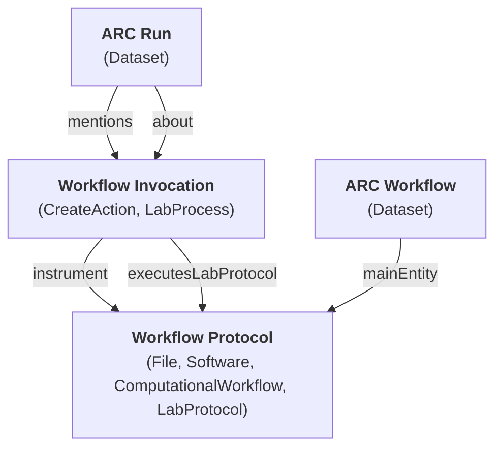
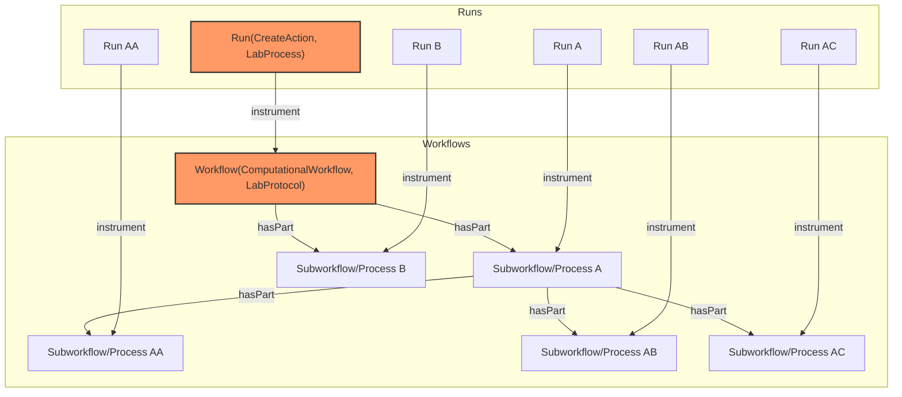

# ARC Workflow Run RO-Crate Profiles

* Version: 1.0.0-draft.2
* Permalink: https://doi.org/10.5281/zenodo.13734332
* Authors
  * Caroline Ott - https://orcid.org/0000-0003-1512-9504
  * Florian Wetzels - https://orcid.org/0000-0002-5526-7138
  * Lukas Weil - https://orcid.org/0000-0003-1945-6342
  * Kevin Schneider - https://orcid.org/0000-0002-2198-5262
* Table of Contents
  * [Overview](#overview)
  * [Requirements](#requirements)
    * [ARC Workflow](#arc-workflow)
    * [Workflow Protocol](#workflow-protocol)
    * [ARC Run](#arc-run)
    * [Workflow Invocation](#workflow-invocation)
    * [FormalParameter](#formalparameter)
    * [PropertyValue](#propertyvalue)
      * [PropertyValue - Workflow Input](#propertyvalue---workflow-input)
      * [PropertyValue - Workflow Input](#propertyvalue---prefix)
      * [PropertyValue - Workflow Input](#propertyvalue---position)
    * [SoftwareApplication](#softwareapplication)
  * [Compatibility with underlying profiles](#compatibility-with-underlying-profiles)
  * [Workflow Run Crate configuration in ARCs](#workflow-run-crate-configuration-in-arcs)
  * [Example ro-crate-metadata.json](#example-ro-crate-metadatajson)

## Overview

The **ARC Workflow Run (arc-wr) RO-Crate Profiles** are a collection of profiles to describe both _`prospective`_ (**workflows**, yet to be executed) and _`retrospective`_ (**runs**, already executed) provenance of the orchestration of computational workflows in [Annotated Research Contexts (ARCs)](https://arc-rdm.org).
The profiles are designed to be re-usable in other profile collections and do not need to describe root entities of an RO-crate.

Computational and laboratory workflows share many similarities, but typically only differ in how they are executed.
In an ARC, the latter are described using the [ISA](https://isa-specs.readthedocs.io/en/latest/isajson.html#) model, separating between a workflow description ([`LabProtocol`](https://bioschemas.org/types/LabProtocol/0.5-DRAFT)) and its execution ([`LabProcess`](https://bioschemas.org/types/LabProcess/0.1-DRAFT)).
These types provide properties to annotate parameterized metadata in the form of key-value pairs using ontology terms.
For computational workflows, workflow descriptions are usually called _workflows_, and their execution is usually coined as a _run_ of said workflow.
**arc-wr** profiles aim to extend established workflow and run profiles to share the same process model as the ISA model, allowing for integration of computational and laboratory workflows in ARCs.
Advantages in regards to provenance include uniform queries, metadata enrichment, or visualization.

**arc-wr** profiles combine a selection of existing profiles, mainly the [Workflow Run Crate (WRC)](https://www.researchobject.org/workflow-run-crate/profiles/workflow_run_crate/) profile collection (which itself combines [Process Run Crate](https://www.researchobject.org/workflow-run-crate/profiles/process_run_crate/) and [Workflow RO-Crate](https://about.workflowhub.eu/Workflow-RO-Crate/)) and extends it by providing means to annotate additional metadata and align terminology with other parts of an ARC.
Therefore, the main purpose of the **arc-wr** profiles is to merge the workflows and runs described by the **WRC** with the `LabProtocol` and `LabProcess` profiles formulated in the [ISA RO Crate Profile](https://doi.org/10.5281/zenodo.13748893) collection, creating a cohesive process model that tracks prospective and retrospective provenance of computational and laboratory workflows.
To allow for the ARC's _immutable but evolving_ nature, **arc-wr** profiles are in general less strict than the underlying profiles, relaxing requirements for many mandatory fields.
However, compatibility is guaranteed when following **both** the Mandatory and Recommended fields of the underlying profiles (see also the [compatibility section](#compatibility-with-underlying-profiles)).

The 4 main entities described by the **arc-wr** profiles are:

* [**`ARC Workflow`**](#arc-workflow)
  * A `Dataset` container object that describes a `workflow folder` inside an ARC.
  * Can be used to enrich a [`Workflow Protocol`](#workflow-protocol) with additional ISA metadata.
  * Contains a `mainEntity` following the [`Workflow Protocol` profile](#workflow-protocol) that describes the _Main Workflow_ of this `workflow folder`, analogous to [Workflow RO Crates](https://about.workflowhub.eu/Workflow-RO-Crate/).
  * Can be a valid [Workflow RO Crate](https://about.workflowhub.eu/Workflow-RO-Crate/), see the [Compatibility section](#compatibility-with-underlying-profiles).
* [**`Workflow Protocol`**](#workflow-protocol)
  * Contains prospective metadata of a workflow, e.g. descriptions of inputs and outputs.
  * A Multi-type object of the types [`MediaObject`](https://schema.org/MediaObject), [`SoftwareSourceCode`](https://schema.org/SoftwareSourceCode), [`ComputationalWorkflow`](https://bioschemas.org/types/ComputationalWorkflow/1.0-RELEASE), and [`LabProtocol`](https://bioschemas.org/types/LabProtocol). It represents the union of computational and laboratory workflow description.
  * Can represent a _Main Workflow_ (`main entity`) of a [Workflow RO Crate](https://about.workflowhub.eu/Workflow-RO-Crate/) following the [bioschemas ComputationalWorkflow profile](https://bioschemas.org/profiles/ComputationalWorkflow/1.0-RELEASE), extended with `LabProtocol` metadata (see also the [Compatibility section](#compatibility-with-underlying-profiles)).
* [**`ARC Run`**](#arc-run)
  * A `Dataset` container object that describes a `run folder` inside an ARC.
  * Can be used to enrich [`Workflow Invocations`](#workflow-invocation) with additional ISA metadata.
* [**`Workflow Invocation`**](#workflow-invocation)
  * A Multi-type object of the types [`CreateAction`](https://schema.org/CreateAction) and [`LabProcess`](https://bioschemas.org/types/LabProcess/0.1-DRAFT). It represents the union of computational and laboratory workflow execution.
  * Represents the invocation of a `Workflow Protocol` with actual values for the parameter slots of the executed `Workflow Protocol`.

They are connected via the following relations:



## Requirements

### ARC Workflow

An ARC Workflow is an object that bundles ISA-compliant administrative metadata (e.g., the person that created it) and the prospective provenance of the workflow in form of [Workflow Protocol(s)](#workflow-protocol).
It is based upon [schema.org/Dataset](https://schema.org/Dataset) and maps to the [ISA-XLSX **Workflow**](https://github.com/nfdi4plants/ARC-specification/blob/release/ISA-XLSX.md#workflow-section).
In the context of an ARC, an ARC Workflow can be seen as the top-level object describing the contents and provenance of a single _workflow folder_ inside the _workflows folder_.

An ARC Workflow contains a `mainEntity` following the [`Workflow Protocol` profile](#workflow-protocol) that describes the _Main Workflow_ of this `workflow folder`, analogous to [Workflow RO Crates](https://about.workflowhub.eu/Workflow-RO-Crate/).

| Property | Required | Cardinality | Expected Type | Description |
|----------|----------|-------------|---------------|-------------|
| <h4>Required Properties</h4><br> | | | | |
| **`@id`** | Required | ONE | [schema.org/Text](https://schema.org/Text)<br>OR [schema.org/URL](https://schema.org/URL) | Used to distinguish the resource being described in JSON-LD. |
| **`@type`** | Required | ONE | [schema.org/Dataset](https://schema.org/Dataset) | Schema.org/Bioschemas class(es) for the resource declared using JSON-LD syntax. |
| **`additionalType`** | Required | ONE | [schema.org/Text](https://schema.org/Text)<br>OR [schema.org/URL](https://schema.org/URL) | MUST be 'ARC Workflow' or ontology term to identify it as an ARC Workflow |
| **`identifier`** | Required | ONE | [schema.org/Text](https://schema.org/Text)<br>OR [schema.org/URL](https://schema.org/URL) | A mandatory unique identifier, either a temporary identifier supplied by users or one generated by a repository or other database. For example, it could be an identifier complying with the LSID specification |
| **`mainEntity`** | Required | ONE | [WorkflowProtocol](#workflow-protocol) | The Main Workflow Protocol described by the ARC Workflow. MUST follow the [Workflow Protocol profile](#workflow-protocol). |
| <h4>Recommended Properties</h4><br> | | | | |
| **`name`** | Recommended | ONE | [schema.org/Text](https://schema.org/Text) | A concise phrase used to encapsulate the purpose and goal of the ARC Workflow. |
| **`description`** | Recommended | ONE | [schema.org/Text](https://schema.org/Text) | A textual description of the ARC Workflow, with components such as objective or goals. |
| **`hasPart`** | Recommended | MANY | [schema.org/MediaObject](https://schema.org/MediaObject)<br>OR [WorkflowProtocol](#workflow-protocol) | All data files that are part of the ARC Workflow. In an ARC, this SHOULD include all contents of the respective `workflow folder` represented by the ARC Workflow object. Can also be used so signify sub-workflows that are part of this workflow's intended orchestration - if this is the case, MUST follow the [Workflow Protocol profile](#workflow-protocol). |
| <h4>Optional Properties</h4><br> | | | | |
| **`url`** | Optional | ONE | [schema.org/URL](https://schema.org/URL) | The filename or path of the metadata file describing the run. Optional, since in some contexts like an ARC the filename is implicit. |

### Workflow Protocol

A multitype object that combines [`ComputationalWorkflow`](https://bioschemas.org/types/ComputationalWorkflow/1.0-RELEASE) and [`LabProtocol`](https://bioschemas.org/types/LabProtocol/0.5-DRAFT), providing prospective provenance of computational workflows that can be understood as traditional workflows as well as from a protocol perspective.

| Property | Required | Cardinality | Expected Type | Description | Source Profile |
|----------|----------|-------------|---------------|-------------|----------------|
| <h4>Required Properties</h4><br> | | | | | |
| **`@context`** | Required | ONE | [schema.org/URL](https://schema.org/URL) | Used to provide the context (namespaces) for the JSON-LD file. Not needed in other serialisations. | https://bioschemas.org/profiles/ComputationalWorkflow |
| **`@type`** | Required | 4 | [schema.org/Text](https://schema.org/Text)<br>AND [schema.org/SoftwareSourceCode](https://schema.org/SoftwareSourceCode)<br>AND [bioschemas.org/ComputationalWorkflow](https://bioschemas.org/types/ComputationalWorkflow)<br>AND [bioschemas.org/LabProtocol](https://bioschemas.org/types/LabProtocol) | Schema.org/Bioschemas class for the resource declared using JSON-LD syntax. For other serialisations please use the appropriate mechanism. While it is permissible to provide multiple types, it is preferred to use a single type. | **THIS PROFILE** |
| **`additionalType`** | Required | ONE | [schema.org/Text](https://schema.org/Text)<br>OR [schema.org/URL](https://schema.org/URL) | MUST be 'Workflow Protocol' or ontology term to identify it as a Workflow Protocol | **THIS PROFILE** |
| **`@id`** | Required | ONE | [IRI](https://datatracker.ietf.org/doc/html/rfc3987#section-2) | Used to distinguish the resource being described in JSON-LD. For other serialisations use the appropriate approach. | https://bioschemas.org/profiles/ComputationalWorkflow |
| <h4>Recommended Properties</h4><br> | | | | | |
| **`input`** | Recommended | MANY | [bioschemas.org/FormalParameter](https://bioschemas.org/types/FormalParameter) | An input required to use the computational workflow (eg. Excel spreadsheet, BAM file) | https://bioschemas.org/profiles/ComputationalWorkflow |
| **`output`** | Recommended | MANY | [bioschemas.org/FormalParameter](https://bioschemas.org/types/FormalParameter) | An output produced by the workflow | https://bioschemas.org/profiles/ComputationalWorkflow |
| **`dct:conformsTo`** | Recommended | 1 | [IRI](https://datatracker.ietf.org/doc/html/rfc3987#section-2) | Used to state the profiles that the markup relates to. MUST be 'https://bioschemas.org/profiles/ComputationalWorkflow/1.0-RELEASE' | https://bioschemas.org/profiles/ComputationalWorkflow |
| **`creator`** | Recommended | MANY | [schema.org/Organization](https://schema.org/Organization)<br>OR [schema.org/Person](https://schema.org/Person) | The creator/author of this CreativeWork. This is the same as the Author property for CreativeWork. | https://bioschemas.org/profiles/ComputationalWorkflow |
| **`dateCreated`** | Recommended | ONE | [schema.org/Date](https://schema.org/Date)<br>OR [schema.org/DateTime](https://schema.org/DateTime) | The date on which the CreativeWork was created or the item was added to a DataFeed. | https://bioschemas.org/profiles/ComputationalWorkflow |
| **`license`** | Recommended | MANY | [schema.org/CreativeWork](https://schema.org/CreativeWork)<br>OR [schema.org/URL](https://schema.org/URL) | A license document that applies to this content, typically indicated by URL. | https://bioschemas.org/profiles/ComputationalWorkflow |
| **`name`** | Recommended | ONE | [schema.org/Text](https://schema.org/Text) | The name of the item. | https://bioschemas.org/profiles/ComputationalWorkflow |
| **`programmingLanguage`** | Recommended | MANY | [schema.org/ComputerLanguage](https://schema.org/ComputerLanguage)<br>OR [schema.org/Text](https://schema.org/Text) | The computer programming language, Scripts written in a programming language, as well as workflows, generally need a runtime; in RO-Crate the runtime SHOULD be indicated using a liberal interpretation of programmingLanguage | https://bioschemas.org/profiles/ComputationalWorkflow |
| **`sdPublisher`** | Recommended | ONE | [schema.org/Organization](https://schema.org/Organization)<br>OR [schema.org/Person](https://schema.org/Person) | The host site for the ComputationalWorkflow | https://bioschemas.org/profiles/ComputationalWorkflow |
| **`url`** | Recommended | ONE | [schema.org/URL](https://schema.org/URL) | URL of the item. | https://bioschemas.org/profiles/ComputationalWorkflow |
| **`version`** | Recommended | ONE | [schema.org/Text](https://schema.org/Text)<br>OR [schema.org/Number](https://schema.org/Number) | Version is a release. The date modified may not warrant a release, but last date modified and access to all versions is important | https://bioschemas.org/profiles/ComputationalWorkflow |
| <h4>Optional Properties</h4><br> | | | | | |
| **`description`** | Optional | ONE | [schema.org/Text](https://schema.org/Text) | A description of the item. | https://bioschemas.org/profiles/ComputationalWorkflow |
| **`hasPart`** | Optional | MANY | [schema.org/CreativeWork](https://schema.org/CreativeWork) | The tools/scripts that are (potentially) used by the ComputationalWorkflow when it is executed, The parts are not ordered; they normally correspond to steps in the workflow, there is no specified mapping. | https://bioschemas.org/profiles/ComputationalWorkflow |
| **`intendedUse`** | Optional | ONE | [schema.org/DefinedTerm](https://schema.org/DefinedTerm)<br>OR [schema.org/Text](https://schema.org/Text)<br>OR [schema.org/URL](https://schema.org/URL) | The protocol type as an ontology term | isa-ro-crate-profile/LabProtocol |
| **`comment`** | Optional | MANY | [schema.org/Comment](https://schema.org/Comment) |  | isa-ro-crate-profile/LabProtocol |
| **`computationalTool`** | Optional | MANY | [schema.org/SoftwareApplication](https://schema.org/SoftwareApplication)<br>OR [schema.org/DefinedTerm](https://schema.org/DefinedTerm)<br>OR [schema.org/PropertyValue](https://schema.org/PropertyValue) | Software or tool used as part of the lab protocol to complete a part of it. | isa-ro-crate-profile/LabProtocol |

### ARC Run

An ARC Run is an object that bundles ISA-compliant administrative metadata (e.g., the person that executed it) and the retrospective provenance of the run in form of [Workflow Invocation(s)](#workflow-invocation).
It is based upon [schema.org/Dataset](https://schema.org/Dataset) and maps to the [ISA-XLSX **Run**](https://github.com/nfdi4plants/ARC-specification/blob/release/ISA-XLSX.md#run-section).
In the context of an ARC, an ARC Run can be seen as the top-level object describing the contents and provenance of a single _run folder_ inside the _runs folder_.

| Property | Required | Cardinality | Expected Type | Description |
|----------|----------|-------------|---------------|-------------|
| <h4>Required Properties</h4><br> | | | | |
| **`@id`** | Required | ONE | [schema.org/Text](https://schema.org/Text)<br>OR [schema.org/URL](https://schema.org/URL) | Used to distinguish the resource being described in JSON-LD. |
| **`@type`** | Required | ONE | [schema.org/Dataset](https://schema.org/Dataset) | Schema.org/Bioschemas class(es) for the resource declared using JSON-LD syntax. |
| **`additionalType`** | Required | ONE | [schema.org/Text](https://schema.org/Text)<br>OR [schema.org/URL](https://schema.org/URL) | MUST be 'ARC Run' or ontology term to identify it as an ARC Run |
| **`identifier`** | Required | ONE | [schema.org/Text](https://schema.org/Text)<br>OR [schema.org/URL](https://schema.org/URL) | A mandatory unique identifier, either a temporary identifier supplied by users or one generated by a repository or other database. For example, it could be an identifier complying with the LSID specification |
| <h4>Recommended Properties</h4><br> | | | | |
| **`name`** | Recommended | ONE | [schema.org/Text](https://schema.org/Text) | A concise phrase used to encapsulate the purpose and goal of the ARC Run. |
| **`description`** | Recommended | ONE | [schema.org/Text](https://schema.org/Text) | A textual description of the ARC Run, with components such as objective or goals. |
| **`about`** | Recommended | MANY | [WorkflowInvocation](#workflow-invocation) | The Workflow Invocation(s) described by the ARC Run. MUST follow the [Workflow Invocation profile](#workflow-invocation). MUST be equal to the `mentions` property |
| **`mentions`** | Recommended | MANY | [WorkflowInvocation](#workflow-invocation) | The Workflow Invocation(s) described by the ARC Run. MUST follow the [Workflow Invocation profile](#workflow-invocation). MUST be equal to the `about` property |
| **`creator`** | Recommended | MANY | [schema.org/Person](https://schema.org/Person) | The performer(s) of the ARC Run. |
| **`hasPart`** | Recommended | MANY | [schema.org/MediaObject](https://schema.org/MediaObject)<br>OR [WorkflowProtocol](#workflow-protocol) | All data files that are part of the ARC Run. In an ARC, this should include all contents of the respective `run folder` represented by the ARC Run object. |
| **`measurementMethod`** | Recommended | ONE | [schema.org/URL](https://schema.org/URL)<br>OR [schema.org/DefinedTerm](https://schema.org/DefinedTerm) | Term to identify the technology used to perform the computation, e.g. statistical testing. The term can be free text or from, for example, a controlled vocabulary or an ontology. |
| **`measurementTechnique`** | Recommended | ONE | [schema.org/URL](https://schema.org/URL)<br>OR [schema.org/DefinedTerm](https://schema.org/DefinedTerm) | Software Publisher/Creator and/or Software name used for the computation. |
| **`conformsTo`** | Recommended | ONE | [schema.org/CreativeWork](https://schema.org/CreativeWork) | MUST reference a CreativeWork entity with an @id URI that is consistent with the versioned Permalink of this document, e.g. {"@id": "https://w3id.org/ro/wfrun/process/0.4"} |
| <h4>Optional Properties</h4><br> | | | | |
| **`url`** | Optional | ONE | [schema.org/URL](https://schema.org/URL) | The filename or path of the metadata file describing the run. Optional, since in some contexts like an ARC the filename is implicit. |
| **`variableMeasured`** | Optional | ONE | [schema.org/Text](https://schema.org/Text)<br>OR [schema.org/PropertyValue](https://schema.org/PropertyValue) | A term to qualify the endpoint, or what is being computed (e.g. gene expression profiling or protein identification). The term can be free text or from, for example, a controlled vocabulary or an ontology. |

### Workflow Invocation

A multitype object that combines [`CreateAction`](https://schema.org/CreateAction) and [`LabProcess`](https://bioschemas.org/types/LabProcess/0.1-DRAFT), providing retrospective provenance of computational workflow execution that can be understood as traditional workflow runs as well as from a process sequence perspective.

| Property | Required | Cardinality | Expected Type | Description | Source Profile |
|----------|----------|-------------|---------------|-------------|----------------|
| <h4>Required Properties</h4><br> | | | | | |
| **`@id`** | Required | ONE | [IRI](https://datatracker.ietf.org/doc/html/rfc3987#section-2) | A unique identifier for the execution, e.g. "urn:uuid:50ec5c76-1f7a-4130-8ef6-846756b228c1", "#f99a8e6c". MAY be an absolute URI, e.g. http://example.com/runs/846756b228c1. The use of randomly generated UUIDs (type 4) is RECOMMENDED. SHOULD be listed under mentions of the root data entity. | https://www.researchobject.org/workflow-run-crate/profiles/process_run_crate |
| **`@type`** | Required | 2 | [schema.org/CreateAction](https://schema.org/CreateAction)<br>AND [bioschemas.org/LabProcess](https://bioschemas.org/types/LabProcess/0.1-DRAFT) | MUST be LabProcess and CreateAction to indicate that this tool created the result data entities | https://github.com/nfdi4plants/arc-wr-ro-crate-profile/blob/release/profile/arc_wr_ro_crate.md |
| **`additionalType`** | Required | ONE | [schema.org/Text](https://schema.org/Text)<br>OR [schema.org/URL](https://schema.org/URL) | MUST be 'Workflow Invocation' or ontology term to identify it as a Workflow Invocation | **THIS PROFILE** |
| **`instrument`** | Required | MANY | [WorkflowProtocol](#workflow-protocol) | The executed Workflow Protocol. MUST follow the [Workflow Protocol profile](#workflow-protocol). MUST be equal to the `executesLabProtocol` property. | https://www.researchobject.org/workflow-run-crate/profiles/process_run_crate; https://www.researchobject.org/workflow-run-crate/profiles/workflow_run_crate |
| **`executesLabProtocol`** | Required | ONE | [WorkflowProtocol](#workflow-protocol) | The executed Workflow Protocol. MUST follow the [Workflow Protocol profile](#workflow-protocol). MUST be equal to the `instrument` property. | https://bioschemas.org/types/LabProcess/0.1-DRAFT |
| **`result`** | Required | MANY | [schema.org/MediaObject](https://schema.org/MediaObject)<br>OR [schema.org/Dataset](https://schema.org/Dataset)<br>OR [schema.org/Collection](https://schema.org/Collection)<br>OR [schema.org/CreativeWork](https://schema.org/CreativeWork)<br>OR [schema.org/PropertyValue](https://schema.org/PropertyValue) | The identifier of one or more entities that were created or modified by this action, e.g. output files. Entities referenced by an action's object or result SHOULD be of type File (an RO-Crate alias for MediaObject) for files, Dataset for directories and Collection for multi-file datasets, but MAY be a CreativeWork for other types of data (e.g. an online database); they MAY be of type PropertyValue to capture numbers/strings that are not stored as files. | https://www.researchobject.org/workflow-run-crate/profiles/process_run_crate, https://bioschemas.org/types/LabProcess/0.1-DRAFT |
| **`object`** | Required | MANY | [schema.org/MediaObject](https://schema.org/MediaObject)<br>OR [schema.org/Dataset](https://schema.org/Dataset)<br>OR [schema.org/Collection](https://schema.org/Collection)<br>OR [schema.org/CreativeWork](https://schema.org/CreativeWork)<br>OR [schema.org/PropertyValue](https://schema.org/PropertyValue) | The identifier of one or more entities of the RO-Crate that were consumed by this action, e.g. input files or reference datasets. Entities referenced by an action's object or result SHOULD be of type File (an RO-Crate alias for MediaObject) for files, Dataset for directories and Collection for multi-file datasets, but MAY be a CreativeWork for other types of data (e.g. an online database); they MAY be of type PropertyValue to capture numbers/strings that are not stored as files. | https://www.researchobject.org/workflow-run-crate/profiles/process_run_crate, https://bioschemas.org/types/LabProcess/0.1-DRAFT |
| **`name`** | Required | ONE | [schema.org/Text](https://schema.org/Text) | Short human-readable description of the execution. | https://bioschemas.org/types/LabProcess/0.1-DRAFT |
| <h4>Recommended Properties</h4><br> | | | | | |
| <h4>Optional Properties</h4><br> | | | | | |
| **`parameterValue`** | Optional | ONE | [schema.org/PropertyValue](https://schema.org/PropertyValue) | A parameter value of the workflow invocation, usually a key-value pair using ontology terms | https://bioschemas.org/types/LabProcess/0.1-DRAFT |
| **`description`** | Optional | ONE | [schema.org/Text](https://schema.org/Text)<br>OR [schema.org/TextObject](https://schema.org/TextObject) | Details of the execution, for instance command line arguments or settings. This field is for information only, no particular structure is to be assumed. | https://www.researchobject.org/workflow-run-crate/profiles/process_run_crate |

### FormalParameter

`FormalParameter`s are used to describe shape and type of `input`s and `output`s of a [Workflow Protocol](#workflow-protocol).
They provide prospective provenance, while their realized values are described by [`Workflow Input`s](#propertyvalue---workflow-input) in [Workflow Invocations](#workflow-invocation).

| Property | Required | Cardinality | Expected Type | Description | Source Profile |
|----------|----------|-------------|---------------|-------------|----------------|
| <h4>Required Properties</h4><br> | | | | | |
| **`@id`** | Required | ONE | [IRI](https://datatracker.ietf.org/doc/html/rfc3987#section-2) | Used to distinguish the resource being described in JSON-LD. For other serialisations use the appropriate approach. | https://bioschemas.org/profiles/FormalParameter/1.1-DRAFT |
| **`@type`** | Required | MANY | [bioschemas.org/FormalParameter](https://bioschemas.org/types/FormalParameter) | Schema.org/Bioschemas class for the resource declared using JSON-LD syntax. For other serialisations please use the appropriate mechanism. While it is permissible to provide multiple types, it is preferred to use a single type. | https://bioschemas.org/profiles/FormalParameter/1.1-DRAFT |
| **`additionalType`** | Required | ONE | [schema.org/Text](https://schema.org/Text)<br>OR [schema.org/URL](https://schema.org/URL) | SHOULD include: File, Dataset or Collection if it maps to a file, directory or multi-file dataset, respectively; PropertyValue if it maps to a dictionary-like structured value (e.g. a CWL record); DataType or one of its subtypes (e.g. Integer) if it maps to a non-structured value. | https://www.researchobject.org/workflow-run-crate/profiles/workflow_run_crate |
| <h4>Recommended Properties</h4><br> | | | | | |
| **`dct:conformsTo`** | Recommended | 1 | [IRI](https://datatracker.ietf.org/doc/html/rfc3987#section-2) | Used to state the profiles that the markup relates to. MUST be 'https://bioschemas.org/profiles/FormalParameter/0.1-DRAFT-2020_07_21' | https://bioschemas.org/profiles/ComputationalWorkflow |
| **`encodingFormat`** | Recommended | MANY | [schema.org/Text](https://schema.org/Text)<br>OR [schema.org/URL](https://schema.org/URL) | Media type typically expressed using a MIME format (see IANA site and MDN reference) e.g. application/zip for a SoftwareApplication binary, audio/mpeg for .mp3 etc.). In cases where a CreativeWork has several media type representations, encoding can be used to indicate each MediaObject alongside particular encodingFormat information. Unregistered or niche encoding and file formats can be indicated instead via the most appropriate URL, e.g. defining Web page or a Wikipedia/Wikidata entry. Supersedes fileFormat. | https://bioschemas.org/types/FormalParameter/1.0-RELEASE,https://www.researchobject.org/ro-crate/specification/1.1/workflows.html |
| **`name`** | Recommended | ONE | [schema.org/Text](https://schema.org/Text) | SHOULD match the name of the corresponding workflow parameter slot, e.g. n_lines. | https://www.researchobject.org/workflow-run-crate/profiles/workflow_run_crate |
| <h4>Optional Properties</h4><br> | | | | | |
| **`description`** | Optional | ONE | [schema.org/Text](https://schema.org/Text) | A description of the parameter's purpose, e.g. Number of lines. | https://www.researchobject.org/workflow-run-crate/profiles/workflow_run_crate |
| **`workExample`** | Optional | ONE | [IRI](https://datatracker.ietf.org/doc/html/rfc3987#section-2) | Identifier of the data entity or PropertyValue instance that realizes this parameter. The data entity or PropertyValue instance SHOULD refer to this parameter via exampleOfWork. | https://www.researchobject.org/workflow-run-crate/profiles/workflow_run_crate/ |
| **`defaultValue`** | Optional | ONE | [schema.org/Text](https://schema.org/Text)<br>OR [schema.org/Thing](https://schema.org/Thing) | The default value of the input. For literals, this is a literal value. For objects, it is an ID reference. | https://bioschemas.org/types/FormalParameter/1.0-RELEASE |
| **`valueRequired`** | Optional | ONE | [schema.org/Boolean](https://schema.org/Boolean) | For an input, whether a value must be specified for the workflow to be run. Default is false. | https://bioschemas.org/types/FormalParameter/1.0-RELEASE |
| **`identifier`** | Optional | MANY | [schema.org/PropertyValue](https://schema.org/PropertyValue) | A description for the prefix or position of a FormalParameter as an input. MUST be [PropertyValue - Prefix](#propertyvalue-prefix) or [PropertyValue - Position](#propertyvalue-position) | https://www.researchobject.org/workflow-run-crate/profiles/workflow_run_crate |

### PropertyValue

Where possible, PropertyValues representing `parameterValue`s in process sequences of [WorkflowInvocations](#workflow-invocation) SHOULD follow the respective (sub)profile defined in the [ISA RO-Crate Profile](https://github.com/nfdi4plants/isa-ro-crate-profile/blob/release/profile/isa_ro_crate.md#propertyvalue)

#### PropertyValue - Workflow Input

A `PropertyValue` that is used as an `object` in a [Workflow Invocation](#workflow-invocation) to describe the realized value for an `input` of a [Workflow Protocol](#workflow-protocol). Distinguishes this `PropertyValue` from process sequence related `object`s by linking it to the realized `input` via the `exampleOfWork` property.

| Property | Required | Cardinality | Expected Type | Description | Source Profile |
|----------|----------|-------------|---------------|-------------|----------------|
| <h4>Required Properties</h4><br> | | | | | |
| **`@id`** | Required | ONE | [IRI](https://datatracker.ietf.org/doc/html/rfc3987#section-2) | Used to distinguish the resource being described in JSON-LD. For other serialisations use the appropriate approach. | https://schema.org/PropertyValue |
| **`@type`** | Required | MANY | [schema.org/PropertyValue](https://schema.org/PropertyValue) | Schema.org class for the resource declared using JSON-LD syntax. For other serialisations please use the appropriate mechanism. While it is permissible to provide multiple types, it is preferred to use a single type. | https://schema.org/PropertyValue |
| **`additionalType`** | Required | ONE | [schema.org/Text](https://schema.org/Text)<br>OR [schema.org/URL](https://schema.org/URL) | MUST be 'Workflow Input' or ontology term to identify it as a Workflow Input | **THIS PROFILE** |
| **`exampleOfWork`** | Required | ONE | [IRI](https://datatracker.ietf.org/doc/html/rfc3987#section-2) | Identifier of the FormalParameter instance realized by this entity - intended to describe realization of `input`s of [Workflow Protocols](#workflow-protocol) in [Workflow Invocations](workflow-invocation). MUST refer to a `input` of a [Workflow Protocol](#workflow-protocol) to distinguish from inputs that are process parameters. | https://schema.org/PropertyValue |
| **`value`** | Required | ONE | [schema.org/Boolean](https://schema.org/Boolean)<br>OR [schema.org/Number](https://schema.org/Number)<br>OR [schema.org/StructuredValue](https://schema.org/StructuredValue)<br>OR [schema.org/Text](https://schema.org/Text) | The value of a QuantitativeValue (including Observation) or property value node. For QuantitativeValue and MonetaryAmount, the recommended type for values is 'Number'. For PropertyValue, it can be 'Text', 'Number', 'Boolean', or 'StructuredValue'. Use values from 0123456789 [Add to Citavi project by ISBN] (Unicode 'DIGIT ZERO' (U+0030) to 'DIGIT NINE' (U+0039)) rather than superficially similar Unicode symbols. Use '.' (Unicode 'FULL STOP' (U+002E)) rather than ',' to indicate a decimal point. Avoid using these symbols as a readability separator. | https://schema.org/PropertyValue |
| <h4>Recommended Properties</h4><br> | | | | | |
| **`name`** | Recommended | ONE | [schema.org/Text](https://schema.org/Text) | The name of the item. | https://schema.org/Thing |
| <h4>Optional Properties</h4><br> | | | | | |

#### PropertyValue - Prefix

A `PropertyValue` that is used to describe the prefix of an `input` of a [Workflow Protocol](#workflow-protocol) described by a [FormalParameter](#formalparameter).

| Property | Required | Cardinality | Expected Type | Description | Source Profile |
|----------|----------|-------------|---------------|-------------|----------------|
| <h4>Required Properties</h4><br> | | | | | |
| **`@id`** | Required | ONE | [IRI](https://datatracker.ietf.org/doc/html/rfc3987#section-2) | Used to distinguish the resource being described in JSON-LD. For other serialisations use the appropriate approach. | https://schema.org/PropertyValue |
| **`@type`** | Required | MANY | [schema.org/PropertyValue](https://schema.org/PropertyValue) | Schema.org class for the resource declared using JSON-LD syntax. For other serialisations please use the appropriate mechanism. While it is permissible to provide multiple types, it is preferred to use a single type. | https://schema.org/PropertyValue |
| **`name`** | Required | ONE | [schema.org/Text](https://schema.org/Text) | MUST be 'Prefix' | **THIS PROFILE** |
| **`value`** | Required | ONE | [schema.org/Text](https://schema.org/Text) | The CLI prefix of an input from a [Workflow Protocol profile](#workflow-protocol) described by a [FormalParameter](#formalparameter) | **THIS PROFILE** |
| <h4>Recommended Properties</h4><br> | | | | | |
| <h4>Optional Properties</h4><br> | | | | | |

#### PropertyValue - Position

A `PropertyValue` that is used to describe the position of an `input` of a [Workflow Protocol](#workflow-protocol) described by a [FormalParameter](#formalparameter).

| Property | Required | Cardinality | Expected Type | Description | Source Profile |
|----------|----------|-------------|---------------|-------------|----------------|
| <h4>Required Properties</h4><br> | | | | | |
| **`@id`** | Required | ONE | [IRI](https://datatracker.ietf.org/doc/html/rfc3987#section-2) | Used to distinguish the resource being described in JSON-LD. For other serialisations use the appropriate approach. | https://schema.org/PropertyValue |
| **`@type`** | Required | MANY | [schema.org/PropertyValue](https://schema.org/PropertyValue) | Schema.org class for the resource declared using JSON-LD syntax. For other serialisations please use the appropriate mechanism. While it is permissible to provide multiple types, it is preferred to use a single type. | https://schema.org/PropertyValue |
| **`name`** | Required | ONE | [schema.org/Text](https://schema.org/Text) | MUST be 'Position' | **THIS PROFILE** |
| **`value`** | Required | ONE | [schema.org/Number](https://schema.org/Number) | The position of an input from a [Workflow Protocol profile](#workflow-protocol) described by a [FormalParameter](#formalparameter) | **THIS PROFILE** |
| <h4>Recommended Properties</h4><br> | | | | | |
| <h4>Optional Properties</h4><br> | | | | | |

### SoftwareApplication

| Property | Required | Cardinality | Expected Type | Description | Source Profile |
|----------|----------|-------------|---------------|-------------|----------------|
| <h4>Required Properties</h4><br> | | | | | |
| **`@id`** | Required | ONE | [IRI](https://datatracker.ietf.org/doc/html/rfc3987#section-2) | SHOULD be an absolute URI, but MAY be a relative URI to a data entity in the crate (e.g. "bin/simulation4") or a local identifier for tools that are not otherwise described on the web (e.g. "#statistical-analysis") | https://www.researchobject.org/workflow-run-crate/profiles/process_run_crate |
| **`@type`** | Required | MANY | [schema.org/SoftwareApplication](https://schema.org/SoftwareApplication)<br>OR [schema.org/SoftwareSourceCode](https://schema.org/SoftwareSourceCode)<br>OR [bioschemas.org/ComputationalWorkflow](https://bioschemas.org/types/ComputationalWorkflow) | SHOULD include SoftwareApplication, SoftwareSourceCode or ComputationalWorkflow | https://www.researchobject.org/workflow-run-crate/profiles/process_run_crate |
| <h4>Recommended Properties</h4><br> | | | | | |
| **`name`** | Recommended | ONE | [schema.org/Text](https://schema.org/Text) | A human readable name for the tool in general (not just how it was used here) | https://www.researchobject.org/workflow-run-crate/profiles/process_run_crate |
| **`url`** | Recommended | ONE | [schema.org/URL](https://schema.org/URL) | Homepage, documentation or source for the tool | https://www.researchobject.org/workflow-run-crate/profiles/process_run_crate |
| **`softwareVersion`** | Recommended | ONE | [schema.org/Text](https://schema.org/Text) | Version of the software instance. | https://schema.org/SoftwareApplication |
| <h4>Optional Properties</h4><br> | | | | | |
| **`version`** | Optional | ONE | [schema.org/Text](https://schema.org/Text) | The version string for the software application. In the case of a SoftwareApplication, this MAY be provided via the more specific softwareVersion. SoftwareApplication entities SHOULD NOT specify both version and softwareVersion: in this case, consumers SHOULD prioritize softwareVersion. In order to facilitate comparison attempts by consumers, it is RECOMMENDED to specify a machine-readable version string if available (see for instance Python's PEP 440). | https://www.researchobject.org/workflow-run-crate/profiles/process_run_crate/ |
| **`applicationCategory`** | Optional | MANY | [schema.org/Text](https://schema.org/Text)<br>OR [schema.org/URL](https://schema.org/URL) | Type of software application, e.g. 'Game, Multimedia'. | https://schema.org/SoftwareApplication |
| **`downloadUrl`** | Optional | MANY | [schema.org/URL](https://schema.org/URL) | If the file can be downloaded, URL to download the binary. | https://schema.org/SoftwareApplication |
| **`softwareRequirements`** | Optional | MANY | [schema.org/Text](https://schema.org/Text)<br>OR [schema.org/URL](https://schema.org/URL) | Component dependency requirements for application. This includes runtime environments and shared libraries that are not included in the application distribution package, but required to run the application (examples: DirectX, Java or .NET runtime). Supersedes requirements. | https://schema.org/SoftwareApplication |

## Compatibility with underlying profiles

## Workflow Run Crate configuration in ARCs

As described above, workflows can be structured hierarchically.
Each workflow (or sub-workflow) object in the hierarchy can have an associated run object in the RO-Crate metadata.
The structure of JSON objects is visualized below.
Every ARC Run consists of one or more Workflow Runs (and is therefore comparable to an [Assay](https://github.com/nfdi4plants/isa-ro-crate-profile/blob/main/profile/isa_ro_crate.md#assay) in ISA).
To reduce complexity, it is recommended to use top level description (marked red).
One workflow describes the transformation of one set of input data to result data.
If a workflow consists of several steps, forwarding the resulting data to the next step without returning them as a final result, it is described as one Workflow Run Crate.
In other words, runs should only be documented for top-level workflows.



## Example ro-crate-metadata.json

```json
{
  "@context": [
    "https://w3id.org/ro/crate/1.1/context",
    {
      "Sample": "https://bioschemas.org/Sample",
      "additionalProperty": "http://schema.org/additionalProperty",
      "intendedUse": "https://bioschemas.org/intendedUse",
      "computationalTool": "https://bioschemas.org/computationalTool",
      "labEquipment": "https://bioschemas.org/labEquipment",
      "reagent": "https://bioschemas.org/reagent",
      "LabProtocol": "https://bioschemas.org/LabProtocol",
      "executesLabProtocol": "https://bioschemas.org/executesLabProtocol",
      "parameterValue": "https://bioschemas.org/parameterValue",
      "LabProcess": "https://bioschemas.org/LabProcess",
      "measurementMethod": "http://schema.org/measurementMethod",
      "FormalParameter": "https://bioschemas.org/FormalParameter",
      "ComputationalWorkflow": "https://bioschemas.org/ComputationalWorkflow",
      "SoftwareSourceCode": "http://schema.org/SoftwareSourceCode",
      "input": "https://bioschemas.org/input",
      "output": "https://bioschemas.org/output"
    }
  ],
  "@graph": [
    {
      "@id": "studies/Yeast/",
      "@type": "Dataset",
      "additionalType": "Study",
      "identifier": "Yeast",
      "dateModified": "2025-06-24T11:48:36.3920198"
    },
    {
      "@id": "#Organization_Technische_Fakultät,_Institut_für_Informatik_(IIF)",
      "@type": "Organization",
      "name": "Technische Fakultät, Institut für Informatik (IIF)"
    },
    {
      "@id": "https://credit.niso.org/contributor-roles/formal-analysis/",
      "@type": "DefinedTerm",
      "name": "Formal analysis",
      "termCode": "https://credit.niso.org/contributor-roles/formal-analysis/"
    },
    {
      "@id": "#Person_Björn_Grüning",
      "@type": "Person",
      "givenName": "Björn",
      "affiliation": {
        "@id": "#Organization_Technische_Fakultät,_Institut_für_Informatik_(IIF)"
      },
      "email": "gruening@informatik.uni-freiburg.de",
      "familyName": "Grüning",
      "jobTitle": {
        "@id": "https://credit.niso.org/contributor-roles/formal-analysis/"
      },
      "address": "Georges-Köhler-Allee 106, 79110 Freiburg"
    },
    {
      "@id": "https://w3id.org/workflowhub/workflow-ro-crate#galaxy",
      "@type": "ComputerLanguage",
      "name": "Galaxy",
      "identifier": {
        "@id": "https://galaxyproject.org/"
      },
      "url": {
        "@id": "https://galaxyproject.org/"
      }
    },
    {
      "@id": "#FormalParameter_W_Shuffle_parameter1",
      "@type": "FormalParameter",
      "additionalType": "File",
      "name": "parameter1",
      "valueRequired": true
    },
    {
      "@id": "#FormalParameter_W_Shuffle_outputFile1",
      "additionalType": "File",
      "@type": "FormalParameter",
      "name": "outputFile1"
    },
    {
      "@id": "workflows/Shuffle/ShuffleSequences.ga",
      "@type": [
        "File",
        "ComputationalWorkflow",
        "SoftwareSourceCode",
        "LabProtocol"
      ],
      "additionalType": "WorkflowProtocol",
      "creator": {
        "@id": "#Person_Björn_Grüning"
      },
      "programmingLanguage": {
        "@id": "https://w3id.org/workflowhub/workflow-ro-crate#galaxy"
      },
      "name": "FASTA shuffle workflow",
      "input": {
        "@id": "#FormalParameter_W_Shuffle_parameter1"
      },
      "output": {
        "@id": "#FormalParameter_W_Shuffle_outputFile1"
      }
    },
    {
      "@id": "workflows/Shuffle/",
      "@type": "Dataset",
      "additionalType": "Workflow",
      "identifier": "Shuffle",
      "creator": {
        "@id": "#Person_Björn_Grüning"
      },
      "name": "FASTA shuffle workflow",
      "mainEntity": {
        "@id": "workflows/Shuffle/ShuffleSequences.ga"
      }
    },
    {
      "@id": "#Organization_Department_of_Biology,_University_of_Kaiserslautern",
      "@type": "Organization",
      "name": "Department of Biology, University of Kaiserslautern"
    },
    {
      "@id": "#Person_Caroline_Ott",
      "@type": "Person",
      "givenName": "Caroline",
      "affiliation": {
        "@id": "#Organization_Department_of_Biology,_University_of_Kaiserslautern"
      },
      "email": "caroline.ott@rptu.de",
      "familyName": "Ott",
      "additionalName": "J. V.",
      "address": "Erwin-Schrödinger-Straße 56, Kaiserslautern, DE"
    },
    {
      "@id": "studies/Yeast/resources/Yeast.fasta",
      "@type": "File",
      "name": "studies/Yeast/resources/Yeast.fasta",
      "exampleOfWork": {
        "@id": "#FormalParameter_W_Out_parameter1"
      }
    },
    {
      "@id": "#FactorValue_decoy_DB_type_shuffle_Random",
      "@type": "PropertyValue",
      "additionalType": "FactorValue",
      "name": "decoy DB type shuffle",
      "value": "Random",
      "propertyID": "https://www.ebi.ac.uk/ols4/ontologies/ms/classes/http%253A%252F%252Fpurl.obolibrary.org%252Fobo%252FMS_1001452",
      "valueReference": "https://bioregistry.io/NCIT:C60702",
      "columnIndex": "0"
    },
    {
      "@id": "runs/Out/Galaxy6-[Tabular-to-FASTA on data 5].fasta",
      "@type": "File",
      "name": "runs/Out/Galaxy6-[Tabular-to-FASTA on data 5].fasta",
      "additionalProperty": {
        "@id": "#FactorValue_decoy_DB_type_shuffle_Random"
      }
    },
    {
      "@id": "#ParameterValue_data_transformation_Addition",
      "@type": "PropertyValue",
      "additionalType": "ParameterValue",
      "name": "data transformation",
      "value": "Addition",
      "propertyID": "https://www.ebi.ac.uk/ols4/ontologies/ms/classes/http%253A%252F%252Fpurl.obolibrary.org%252Fobo%252FMS_1000452",
      "columnIndex": "1"
    },
    {
      "@id": "#ParameterValue_data_transformation_Subtraction",
      "@type": "PropertyValue",
      "additionalType": "ParameterValue",
      "name": "data transformation",
      "value": "Subtraction",
      "propertyID": "https://www.ebi.ac.uk/ols4/ontologies/ms/classes/http%253A%252F%252Fpurl.obolibrary.org%252Fobo%252FMS_1000452",
      "valueReference": "https://bioregistry.io/NCIT:C70590",
      "columnIndex": "2"
    },
    {
      "@id": "#WorkflowInvocation_Out_Shuffle_0",
      "@type": [
        "https://bioschemas.org/CreateAction",
        "LabProcess"
      ],
      "additionalType": "WorkflowInvocation",
      "name": "Out",
      "object": [
        {
          "@id": "studies/Yeast/resources/Yeast.fasta"
        }
      ],
      "result": {
        "@id": "runs/Out/Galaxy6-[Tabular-to-FASTA on data 5].fasta"
      },
      "instrument": {
        "@id": "workflows/Shuffle/ShuffleSequences.ga"
      },
      "executesLabProtocol": {
        "@id": "workflows/Shuffle/ShuffleSequences.ga"
      },
      "parameterValue": [
        {
          "@id": "#ParameterValue_data_transformation_Addition"
        },
        {
          "@id": "#ParameterValue_data_transformation_Subtraction"
        }
      ]
    },
    {
      "@id": "runs/Out/",
      "@type": "Dataset",
      "conformsTo": [
        {
          "@id": "https://w3id.org/ro/wfrun/process/0.1"
        },
        {
          "@id": "https://w3id.org/ro/wfrun/workflow/0.1"
        },
        {
          "@id": "https://w3id.org/workflowhub/workflow-ro-crate/1.0"
        }
      ],
      "additionalType": "Run",
      "identifier": "Out",
      "creator": {
        "@id": "#Person_Caroline_Ott"
      },
      "description": "This run shuffles a fasta",
      "hasPart": [
        {
          "@id": "workflows/Shuffle/ShuffleSequences.ga"
        },
        {
          "@id": "studies/Yeast/resources/Yeast.fasta"
        },
        {
          "@id": "runs/Out/Galaxy6-[Tabular-to-FASTA on data 5].fasta"
        }
      ],
      "name": "FASTA Shuffle",
      "mentions": {
        "@id": "#WorkflowInvocation_Out_Shuffle_0"
      },
      "about": {
        "@id": "#WorkflowInvocation_Out_Shuffle_0"
      }
    },
    {   
      "@id": "https://w3id.org/ro/wfrun/process/0.1",
      "@type": "CreativeWork",
      "name": "Process Run Crate",
      "version": "0.1"
    },
    {   
      "@id": "https://w3id.org/ro/wfrun/workflow/0.1",
      "@type": "CreativeWork",
      "name": "Workflow Run Crate",
      "version": "0.1"
    },
    {   
      "@id": "https://w3id.org/workflowhub/workflow-ro-crate/1.0",
      "@type": "CreativeWork",
      "name": "Workflow RO-Crate",
      "version": "1.0"
    },
    {
      "@id": "./",
      "@type": "Dataset",
      "additionalType": "Investigation",
      "identifier": "ShuffleTest",
      "datePublished": "2025-06-24T11:48:36.3939304",
      "hasPart": [
        {
          "@id": "studies/Yeast/"
        },
        {
          "@id": "workflows/Shuffle/"
        },
        {
          "@id": "runs/Out/"
        }
      ],
      "name": "Shuffle",
      "license": "ALL RIGHTS RESERVED BY THE AUTHORS"
    },
    {
      "@id": "ro-crate-metadata.json",
      "@type": "CreativeWork",
      "conformsTo": [
        {
          "@id": "https://w3id.org/ro/crate/1.1"
        },
        { 
          "@id": "https://w3id.org/workflowhub/workflow-ro-crate/1.0"
        }
      ],
      "about": {
        "@id": "./"
      }
    }
  ]
}
```
