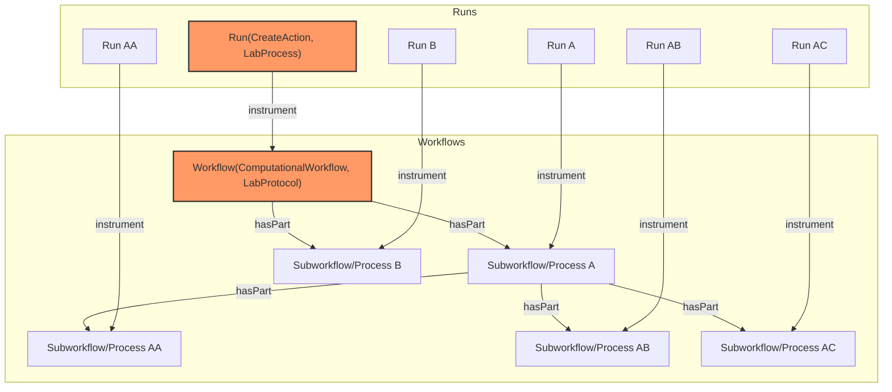

# ARC Workflow Run RO-Crate Profiles

* Version: 1.0.0-draft.1
* Permalink: https://doi.org/10.5281/zenodo.13734332
* Authors
  * Caroline Ott - https://orcid.org/0000-0003-1512-9504
  * Florian Wetzels - https://orcid.org/0000-0002-5526-7138
  * Lukas Weil - https://orcid.org/0000-0003-1945-6342
  * Kevin Schneider - https://orcid.org/0000-0002-2198-5262
* Table of Contents
  * [Overview](#overview)
  * [Requirements](#requirements)
    * [WorkflowProtocol](#workflowprotocol)
    * [WorkflowProtocolInvocation](#workflowprotocolinvocation)
    * [Dataset](#dataset)
    * [FormalParameter](#formalparameter)
    * [PropertyValue](#propertyvalue)
    * [SoftwareApplication](#softwareapplication)
  * [Workflow Run Crate configuration in ARCs](#workflow-run-crate-configuration-in-arcs)
  * [Example ro-crate-metadata.json](#example-ro-crate-metadatajson)
    * [Minimal required fields](#minimal-required-fields)
      * [Workflow Profile](#workflow-profile)
      * [Workflow Run Profile](#workflow-run-profile)
    * [Minimal required fields with metadata](#minimal-required-fields-with-metadata)
      * [CWL Workflow Profile](#cwl-workflow-profile)
      * [Workflow Run Profile](#workflow-run-profile-1)
    * [Workflow Run RO-Crate compliant example](#workflow-run-ro-crate-compliant-example)
      * [Workflow Profile](#workflow-profile-1)
      * [Workflow Run Profile](#workflow-run-profile-2)

## Overview

The ARC Workflow Run RO-Crate profiles describe computational workflows (descriptions of computational processes to transform data) and their invocations (actual executions with specific inputs, outputs and parameters) in experimental settings, specifically within the framework of Annotated Research Contexts (ARC). It therefore consists of two basic parts, called workflows and runs. The run directly references the workflow description and provides the concrete inputs, outputs and parameters for the workflow.

The Common Workflow Language (CWL) allows the use of [metadata](https://www.commonwl.org/user_guide/topics/metadata-and-authorship.html) describing the workflows. The metadata often contains general information about licensing, authorship and affiliation, but is not limited to that. It is possible to describe the steps described by a workflow, or properties describing the run execution, in more detail. This profile aims to specify where and how the metadata contained within CWL workflow and CWL job files should be stored.

The ARC Workflow Run profile mainly follows the [Workflow Run Crate](https://www.researchobject.org/workflow-run-crate/profiles/workflow_run_crate/) profile (which itself combines [Process Run Crate](https://www.researchobject.org/workflow-run-crate/profiles/process_run_crate/)  and [Workflow RO-Crate](https://about.workflowhub.eu/Workflow-RO-Crate/)) and extends it by providing means to annotate additional metadata and align terminology with other parts of an ARC.
Computational workflows and laboratory workflows show many similarities, they typically only differ in how they are executed.
In an ARC, the latter are described using the [ISA](https://isa-specs.readthedocs.io/en/latest/isajson.html#) model, again seperating between a workflow description ([`LabProtocol`](https://bioschemas.org/types/LabProtocol/0.5-DRAFT)) and its execution ([`LabProcess`](https://bioschemas.org/types/LabProcess/0.1-DRAFT)).
These types provide properties to annotate parameterized metadata in the form of key-value pairs using ontology terms.
Therefore, we extend the Workflow Run Crate by integrating these types into the established model.

## Requirements

### WorkflowProtocol

(WIP name)

[[WORKFLOW_PROTOCOL_REQUIREMENTS]]

### WorkflowProtocolInvocation

(WIP name)

(ARC Workflow Run Profile)

[[WORKFLOW_PROTOCOL_INVOCATION_REQUIREMENTS]]

### Dataset

[[DATASET_PROFILE_REQUIREMENTS]]

### FormalParameter

[[FORMAL_PARAMETER_PROFILE_REQUIREMENTS]]

### PropertyValue

[[PROPERTY_VALUE_PROFILE_REQUIREMENTS]]

### SoftwareApplication

[[SOFTWARE_APPLICATION_PROFILE_REQUIREMENTS]]

## Workflow Run Crate configuration in ARCs

As described above, workflows can be structured hierarchically. Each workflow (or sub-workflow) object in the hierarchy can have an associated run object in the RO-Crate metadata. The structure of JSON objects is visualized below. Every ARC Run consists of one or more Workflow Runs (and is therefore comparable to an [Assay](https://github.com/nfdi4plants/isa-ro-crate-profile/blob/main/profile/isa_ro_crate.md#assay) in ISA). To reduce complexity, it is recommended to use top level description (marked red). One workflow describes the transformation of one set of input data to result data. If a workflow consists of several steps, forwarding the resulting data to the next step without returning them as a final result, it is described as one Workflow Run Crate. In other words, runs should only be documented for top-level workflows.



## Example ro-crate-metadata.json

### Minimal required fields

#### Workflow Profile

```json
[[WP_MINIMAL_JSON]]
```

#### Workflow Run Profile

Note: `exampleOfWork` and `workExample` are not required, but make it easier to understand.

```json
[[WPI_MINIMAL_JSON]]
```

### Minimal required fields with metadata

#### CWL Workflow Profile

```json
[[WP_MINIMAL+METADATA_JSON]]
```

#### Workflow Run Profile

Note: `exampleOfWork` and `workExample` are not required, but make it easier to understand.

```json
[[WPI_MINIMAL+METADATA_JSON]]
```

### Workflow Run RO-Crate compliant example

#### Workflow Profile

```json
[[WP_WRCOMPLIANT_JSON]]
```

#### Workflow Run Profile

Note: `exampleOfWork` and `workExample` are not required, but make it easier to understand.

```json
[[WPI_WRCOMPLIANT_JSON]]
```
