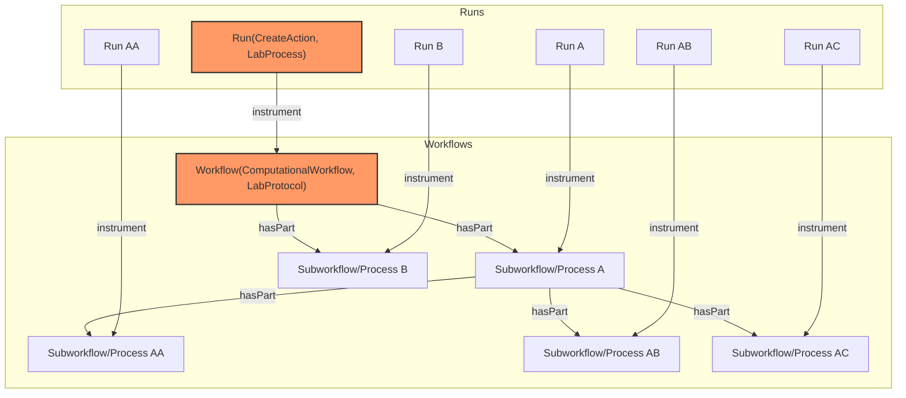

# ARC Workflow Run RO-Crate Profiles

* Version: 1.0.0-draft.1
* Permalink: https://doi.org/10.5281/zenodo.13734332
* Authors
  * Caroline Ott - https://orcid.org/0000-0003-1512-9504
  * Florian Wetzels - https://orcid.org/0000-0002-5526-7138
  * Lukas Weil - https://orcid.org/0000-0003-1945-6342
  * Kevin Schneider - https://orcid.org/0000-0002-2198-5262
* Table of Contents
  * [Overview](#overview)
  * [Requirements](#requirements)
    * [ARC Workflow](#arc-workflow)
    * [Workflow Protocol](#workflow-protocol)
    * [ARC Run](#arc-run)
    * [Workflow Invocation](#workflow-invocation)
    * [Dataset](#dataset)
    * [FormalParameter](#formalparameter)
    * [PropertyValue](#propertyvalue)
    * [SoftwareApplication](#softwareapplication)
  * [Compatibility with underlying profiles](#compatibility-with-underlying-profiles)
  * [Workflow Run Crate configuration in ARCs](#workflow-run-crate-configuration-in-arcs)
  * [Example ro-crate-metadata.json](#example-ro-crate-metadatajson)
    * [Minimal required fields](#minimal-required-fields)
      * [Workflow Profile](#workflow-profile)
      * [Workflow Run Profile](#workflow-run-profile)
    * [Minimal required fields with metadata](#minimal-required-fields-with-metadata)
      * [CWL Workflow Profile](#cwl-workflow-profile)
      * [Workflow Run Profile](#workflow-run-profile-1)
    * [Workflow Run RO-Crate compliant example](#workflow-run-ro-crate-compliant-example)
      * [Workflow Profile](#workflow-profile-1)
      * [Workflow Run Profile](#workflow-run-profile-2)

## Overview

The **ARC Workflow Run (arc-wr) RO-Crate Profiles** are a collection of profiles to describe both _`prospective`_ (**workflows**, yet to be executed) and _`retrospective`_ (**runs**, already executed) provenance of the orchestration of computational workflows in [Annotated Research Contexts (ARCs)](https://arc-rdm.org).
The profiles are designed to be re-usable in other profile collections and do not need to describe root entities of an RO-crate.

Computational and laboratory workflows share many similarities, but typically only differ in how they are executed.
In an ARC, the latter are described using the [ISA](https://isa-specs.readthedocs.io/en/latest/isajson.html#) model, separating between a workflow description ([`LabProtocol`](https://bioschemas.org/types/LabProtocol/0.5-DRAFT)) and its execution ([`LabProcess`](https://bioschemas.org/types/LabProcess/0.1-DRAFT)).
These types provide properties to annotate parameterized metadata in the form of key-value pairs using ontology terms.
For computational workflows, workflow descriptions are usually called _workflows_, and their execution is usually coined as a _run_ of said workflow.
**arc-wr** profiles aim to extend established workflow and run profiles to share the same process model as the ISA model, allowing for integration of computational and laboratory workflows in ARCs.
Advantages in regards to provenance include uniform queries, metadata enrichment, or visualization.

**arc-wr** profiles combine a selection of existing profiles, mainly the [Workflow Run Crate (WRC)](https://www.researchobject.org/workflow-run-crate/profiles/workflow_run_crate/) profile collection (which itself combines [Process Run Crate](https://www.researchobject.org/workflow-run-crate/profiles/process_run_crate/) and [Workflow RO-Crate](https://about.workflowhub.eu/Workflow-RO-Crate/)) and extends it by providing means to annotate additional metadata and align terminology with other parts of an ARC.
Therefore, the main purpose of the **arc-wr** profiles is to merge the workflows and runs described by the **WRC** with the `LabProtocol` and `LabProcess` profiles formulated in the [ISA RO Crate Profile](https://doi.org/10.5281/zenodo.13748893) collection, creating a cohesive process model that tracks prospective and retrospective provenance of computational and laboratory workflows.
To allow for the ARC's _immutable but evolving_ nature, **arc-wr** profiles are in general less strict than the underlying profiles, relaxing requirements for many mandatory fields.
However, compatibility is guaranteed when following **both** the Mandatory and Recommended fields of the underlying profiles (see also the [compatibility section](#compatibility-with-underlying-profiles)).

## Requirements

### ARC Workflow

[[ARC_WORKFLOW_REQUIREMENTS]]

### Workflow Protocol

[[WORKFLOW_PROTOCOL_REQUIREMENTS]]

### ARC Run

[[ARC_RUN_REQUIREMENTS]]

### Workflow Invocation

[[WORKFLOW_INVOCATION_REQUIREMENTS]]

### Dataset

[[DATASET_PROFILE_REQUIREMENTS]]

### FormalParameter

[[FORMAL_PARAMETER_PROFILE_REQUIREMENTS]]

### PropertyValue

[[PROPERTY_VALUE_PROFILE_REQUIREMENTS]]

### SoftwareApplication

[[SOFTWARE_APPLICATION_PROFILE_REQUIREMENTS]]

## Compatibility with underlying profiles

## Workflow Run Crate configuration in ARCs

As described above, workflows can be structured hierarchically.
Each workflow (or sub-workflow) object in the hierarchy can have an associated run object in the RO-Crate metadata.
The structure of JSON objects is visualized below.
Every ARC Run consists of one or more Workflow Runs (and is therefore comparable to an [Assay](https://github.com/nfdi4plants/isa-ro-crate-profile/blob/main/profile/isa_ro_crate.md#assay) in ISA).
To reduce complexity, it is recommended to use top level description (marked red).
One workflow describes the transformation of one set of input data to result data.
If a workflow consists of several steps, forwarding the resulting data to the next step without returning them as a final result, it is described as one Workflow Run Crate.
In other words, runs should only be documented for top-level workflows.



## Example ro-crate-metadata.json

### Minimal required fields

#### Workflow Profile

```json
[[WP_MINIMAL_JSON]]
```

#### Workflow Run Profile

Note: `exampleOfWork` and `workExample` are not required, but make it easier to understand.

```json
[[WPI_MINIMAL_JSON]]
```

### Minimal required fields with metadata

#### CWL Workflow Profile

```json
[[WP_MINIMAL+METADATA_JSON]]
```

#### Workflow Run Profile

Note: `exampleOfWork` and `workExample` are not required, but make it easier to understand.

```json
[[WPI_MINIMAL+METADATA_JSON]]
```

### Workflow Run RO-Crate compliant example

#### Workflow Profile

```json
[[WP_WRCOMPLIANT_JSON]]
```

#### Workflow Run Profile

Note: `exampleOfWork` and `workExample` are not required, but make it easier to understand.

```json
[[WPI_WRCOMPLIANT_JSON]]
```
